# 千亿级电商系统 - 表结构数据设计与流程图

## 目录

- [1. 数据架构设计原则](#1-数据架构设计原则)
- [2. 分库分表策略](#2-分库分表策略)
- [3. 核心业务表设计](#3-核心业务表设计)
- [4. 索引设计策略](#4-索引设计策略)
- [5. 数据流转流程](#5-数据流转流程)
- [6. 数据一致性保证](#6-数据一致性保证)
- [7. Go语言实现示例](#7-go语言实现示例)
- [8. 性能优化策略](#8-性能优化策略)

---

## 1. 数据架构设计原则

### 1.1 设计原则

#### 1.1.1 核心原则
- **数据分离**：读写分离、冷热数据分离、业务数据分离
- **水平扩展**：支持分库分表、按需扩容
- **最终一致性**：在保证性能的前提下，确保数据最终一致
- **高可用性**：多副本、故障自动切换
- **可观测性**：完整的数据血缘和审计日志

#### 1.1.2 千亿级挑战
- **数据量**：单表数据量控制在1000万以内
- **并发量**：支持10万+/秒的读写QPS
- **一致性**：分布式环境下的数据一致性
- **可扩展性**：支持在线扩容和缩容

### 1.2 整体数据架构

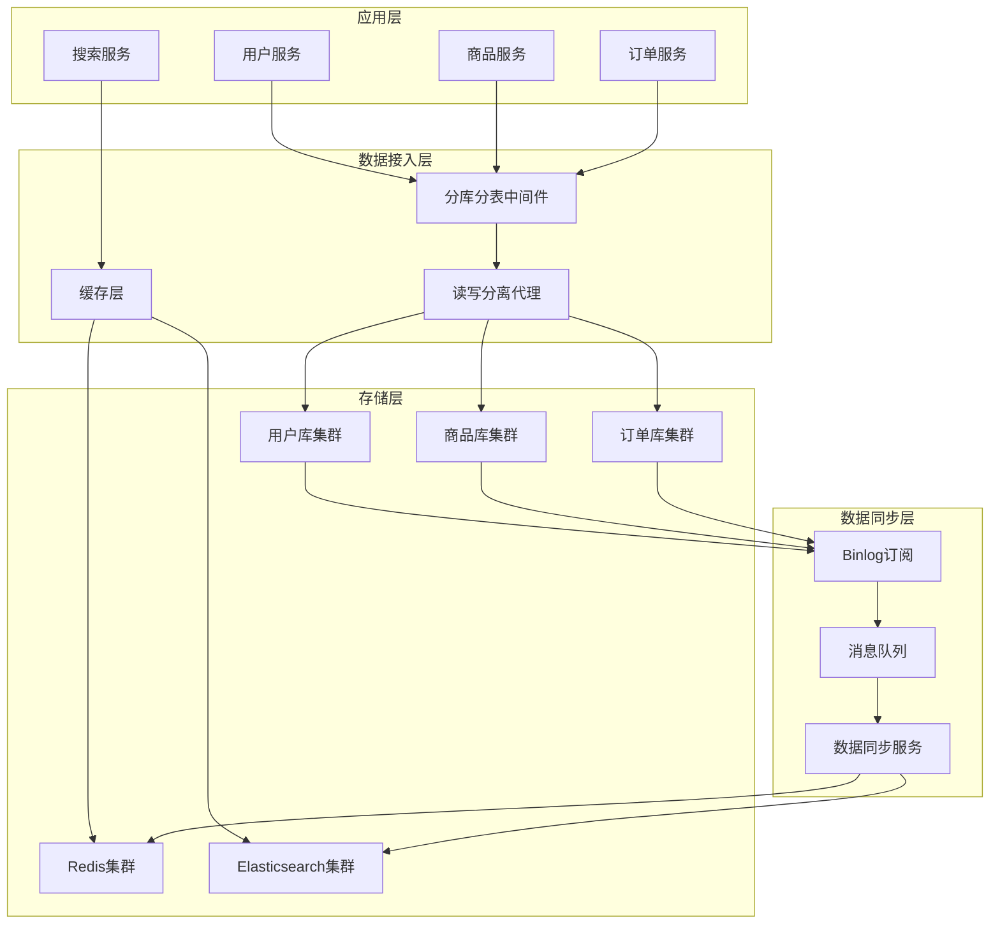

---

## 2. 分库分表策略

### 2.1 分片策略设计

#### 2.1.1 用户数据分片

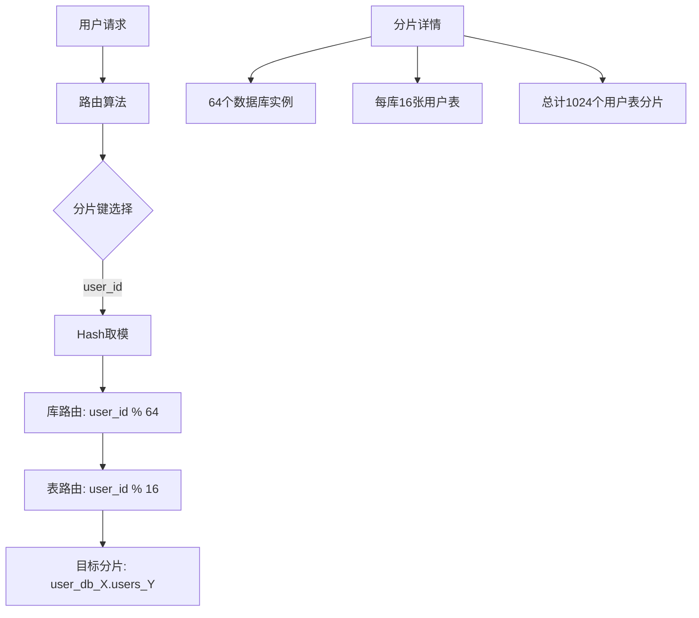

#### 2.1.2 商品数据分片

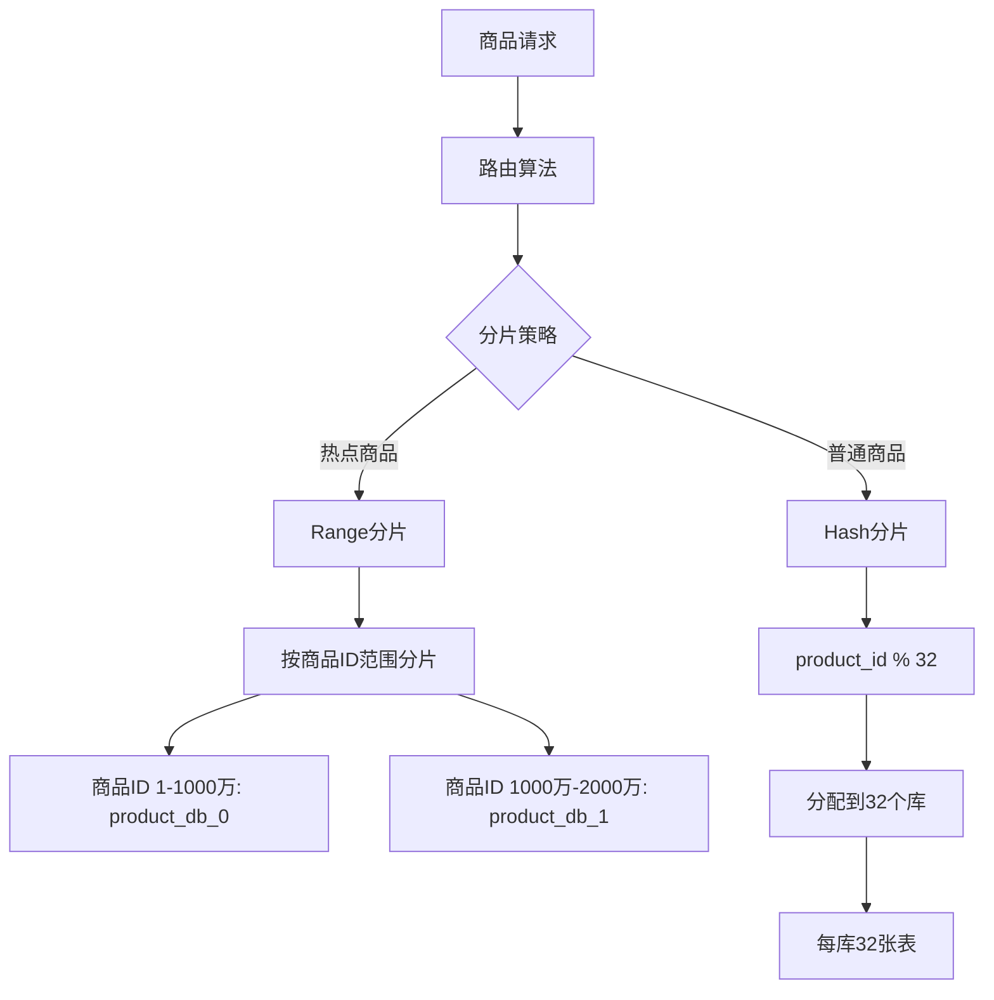

#### 2.1.3 订单数据分片

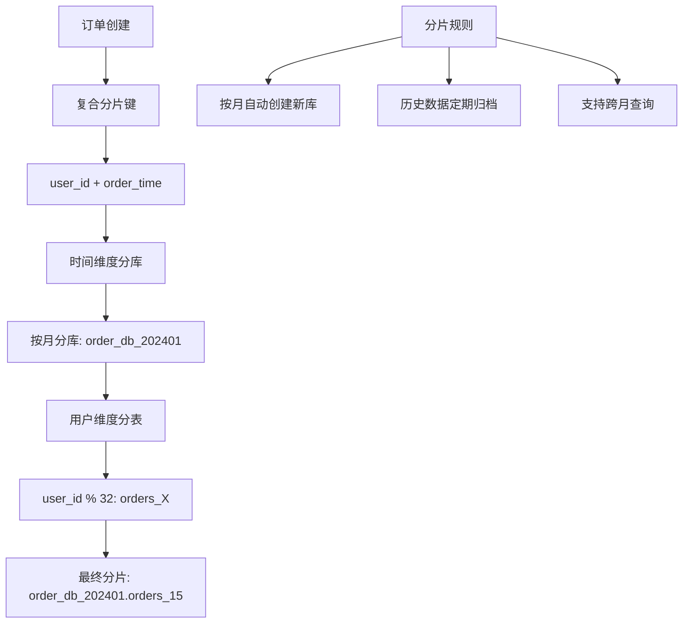

### 2.2 分片配置示例

#### 2.2.1 ShardingSphere配置

```yaml
# 用户库分片配置
spring:
  shardingsphere:
    datasource:
      names: user-ds-0,user-ds-1,user-ds-2,user-ds-3
      user-ds-0:
        type: com.alibaba.druid.pool.DruidDataSource
        driver-class-name: com.mysql.cj.jdbc.Driver
        url: jdbc:mysql://mysql-user-0:3306/user_db_0
        username: ${DB_USER}
        password: ${DB_PASSWORD}
      # ... 其他数据源配置
    
    rules:
      sharding:
        tables:
          users:
            actual-data-nodes: user-ds-$->{0..63}.users_$->{0..15}
            table-strategy:
              standard:
                sharding-column: user_id
                sharding-algorithm-name: users-table-hash-mod
            database-strategy:
              standard:
                sharding-column: user_id
                sharding-algorithm-name: users-db-hash-mod
        
        sharding-algorithms:
          users-table-hash-mod:
            type: HASH_MOD
            props:
              sharding-count: 16
          users-db-hash-mod:
            type: HASH_MOD
            props:
              sharding-count: 64
```

---

## 3. 核心业务表设计

### 3.1 用户相关表

#### 3.1.1 用户基础信息表

```sql
-- 用户基础信息表
CREATE TABLE `users` (
    `user_id` BIGINT UNSIGNED NOT NULL COMMENT '用户ID',
    `username` VARCHAR(50) NOT NULL COMMENT '用户名',
    `email` VARCHAR(100) NULL COMMENT '邮箱',
    `phone` VARCHAR(20) NULL COMMENT '手机号',
    `password_hash` VARCHAR(255) NOT NULL COMMENT '密码哈希',
    `salt` VARCHAR(32) NOT NULL COMMENT '盐值',
    `status` TINYINT NOT NULL DEFAULT 1 COMMENT '状态: 1-正常 2-冻结 3-注销',
    `created_at` TIMESTAMP NOT NULL DEFAULT CURRENT_TIMESTAMP COMMENT '创建时间',
    `updated_at` TIMESTAMP NOT NULL DEFAULT CURRENT_TIMESTAMP ON UPDATE CURRENT_TIMESTAMP COMMENT '更新时间',
    `version` INT NOT NULL DEFAULT 1 COMMENT '版本号-乐观锁',
    PRIMARY KEY (`user_id`),
    UNIQUE KEY `uk_username` (`username`),
    UNIQUE KEY `uk_email` (`email`),
    UNIQUE KEY `uk_phone` (`phone`),
    KEY `idx_status_created` (`status`, `created_at`)
) ENGINE=InnoDB DEFAULT CHARSET=utf8mb4 COLLATE=utf8mb4_unicode_ci 
COMMENT='用户基础信息表';
```

#### 3.1.2 用户画像表

```sql
-- 用户画像表
CREATE TABLE `user_profiles` (
    `user_id` BIGINT UNSIGNED NOT NULL COMMENT '用户ID',
    `gender` TINYINT NULL COMMENT '性别: 1-男 2-女 0-未知',
    `age_group` TINYINT NULL COMMENT '年龄段: 1-18以下 2-18-25 3-26-35 4-36-45 5-46以上',
    `city_code` VARCHAR(10) NULL COMMENT '城市编码',
    `occupation` VARCHAR(50) NULL COMMENT '职业',
    `income_level` TINYINT NULL COMMENT '收入水平: 1-低 2-中 3-高',
    `consumption_level` DECIMAL(10,2) NULL COMMENT '消费水平',
    `interests` JSON NULL COMMENT '兴趣标签JSON',
    `behavior_tags` JSON NULL COMMENT '行为标签JSON',
    `last_active_at` TIMESTAMP NULL COMMENT '最后活跃时间',
    `created_at` TIMESTAMP NOT NULL DEFAULT CURRENT_TIMESTAMP,
    `updated_at` TIMESTAMP NOT NULL DEFAULT CURRENT_TIMESTAMP ON UPDATE CURRENT_TIMESTAMP,
    PRIMARY KEY (`user_id`),
    KEY `idx_city_age` (`city_code`, `age_group`),
    KEY `idx_last_active` (`last_active_at`)
) ENGINE=InnoDB DEFAULT CHARSET=utf8mb4 COLLATE=utf8mb4_unicode_ci 
COMMENT='用户画像表';
```

### 3.2 商家相关表

#### 3.2.1 商家基础信息表

```sql
-- 商家基础信息表
CREATE TABLE `sellers` (
    `seller_id` BIGINT UNSIGNED NOT NULL COMMENT '商家ID',
    `seller_code` VARCHAR(50) NOT NULL COMMENT '商家编码',
    `seller_name` VARCHAR(100) NOT NULL COMMENT '商家名称',
    `seller_type` TINYINT NOT NULL COMMENT '商家类型: 1-自营 2-第三方个人 3-第三方企业',
    `business_license` VARCHAR(100) NULL COMMENT '营业执照号',
    `legal_person` VARCHAR(50) NULL COMMENT '法人代表',
    `contact_name` VARCHAR(50) NOT NULL COMMENT '联系人姓名',
    `contact_phone` VARCHAR(20) NOT NULL COMMENT '联系电话',
    `contact_email` VARCHAR(100) NULL COMMENT '联系邮箱',
    `business_address` VARCHAR(500) NULL COMMENT '经营地址',
    `business_scope` TEXT NULL COMMENT '经营范围',
    `seller_status` TINYINT NOT NULL DEFAULT 1 COMMENT '状态: 1-正常 2-冻结 3-注销',
    `audit_status` TINYINT NOT NULL DEFAULT 1 COMMENT '审核状态: 1-待审核 2-审核通过 3-审核拒绝',
    `settle_type` TINYINT NOT NULL DEFAULT 1 COMMENT '结算方式: 1-月结 2-周结 3-实时',
    `commission_rate` DECIMAL(5,2) NOT NULL DEFAULT 0.00 COMMENT '佣金比例',
    `deposit_amount` DECIMAL(12,2) NOT NULL DEFAULT 0.00 COMMENT '保证金',
    `credit_level` TINYINT NOT NULL DEFAULT 1 COMMENT '信用等级: 1-5',
    `created_at` TIMESTAMP NOT NULL DEFAULT CURRENT_TIMESTAMP,
    `updated_at` TIMESTAMP NOT NULL DEFAULT CURRENT_TIMESTAMP ON UPDATE CURRENT_TIMESTAMP,
    `version` INT NOT NULL DEFAULT 1 COMMENT '版本号',
    PRIMARY KEY (`seller_id`),
    UNIQUE KEY `uk_seller_code` (`seller_code`),
    KEY `idx_seller_type` (`seller_type`),
    KEY `idx_status` (`seller_status`, `audit_status`),
    KEY `idx_contact_phone` (`contact_phone`),
    KEY `idx_created_at` (`created_at`)
) ENGINE=InnoDB DEFAULT CHARSET=utf8mb4 COLLATE=utf8mb4_unicode_ci 
COMMENT='商家基础信息表';

-- 商家认证信息表
CREATE TABLE `seller_certifications` (
    `cert_id` BIGINT UNSIGNED NOT NULL AUTO_INCREMENT COMMENT '认证ID',
    `seller_id` BIGINT UNSIGNED NOT NULL COMMENT '商家ID',
    `cert_type` TINYINT NOT NULL COMMENT '认证类型: 1-身份证 2-营业执照 3-税务登记 4-银行开户许可',
    `cert_number` VARCHAR(100) NOT NULL COMMENT '证件号码',
    `cert_name` VARCHAR(100) NOT NULL COMMENT '证件名称',
    `cert_images` JSON NULL COMMENT '证件图片URL列表',
    `issue_date` DATE NULL COMMENT '发证日期',
    `expire_date` DATE NULL COMMENT '到期日期',
    `audit_status` TINYINT NOT NULL DEFAULT 1 COMMENT '审核状态: 1-待审核 2-通过 3-拒绝',
    `audit_remark` VARCHAR(500) NULL COMMENT '审核备注',
    `auditor_id` BIGINT UNSIGNED NULL COMMENT '审核人ID',
    `audit_time` TIMESTAMP NULL COMMENT '审核时间',
    `created_at` TIMESTAMP NOT NULL DEFAULT CURRENT_TIMESTAMP,
    `updated_at` TIMESTAMP NOT NULL DEFAULT CURRENT_TIMESTAMP ON UPDATE CURRENT_TIMESTAMP,
    PRIMARY KEY (`cert_id`),
    KEY `idx_seller_id` (`seller_id`),
    KEY `idx_cert_type` (`cert_type`),
    KEY `idx_audit_status` (`audit_status`),
    CONSTRAINT `fk_cert_seller` FOREIGN KEY (`seller_id`) REFERENCES `sellers` (`seller_id`)
) ENGINE=InnoDB DEFAULT CHARSET=utf8mb4 COLLATE=utf8mb4_unicode_ci 
COMMENT='商家认证信息表';

-- 商家店铺信息表
CREATE TABLE `seller_shops` (
    `shop_id` BIGINT UNSIGNED NOT NULL AUTO_INCREMENT COMMENT '店铺ID',
    `seller_id` BIGINT UNSIGNED NOT NULL COMMENT '商家ID',
    `shop_name` VARCHAR(100) NOT NULL COMMENT '店铺名称',
    `shop_logo` VARCHAR(500) NULL COMMENT '店铺LOGO',
    `shop_banner` VARCHAR(500) NULL COMMENT '店铺横幅',
    `shop_description` TEXT NULL COMMENT '店铺描述',
    `service_phone` VARCHAR(20) NULL COMMENT '客服电话',
    `service_qq` VARCHAR(20) NULL COMMENT '客服QQ',
    `service_wechat` VARCHAR(50) NULL COMMENT '客服微信',
    `business_hours` VARCHAR(100) NULL COMMENT '营业时间',
    `shop_status` TINYINT NOT NULL DEFAULT 1 COMMENT '店铺状态: 1-正常 2-休息 3-关闭',
    `created_at` TIMESTAMP NOT NULL DEFAULT CURRENT_TIMESTAMP,
    `updated_at` TIMESTAMP NOT NULL DEFAULT CURRENT_TIMESTAMP ON UPDATE CURRENT_TIMESTAMP,
    PRIMARY KEY (`shop_id`),
    KEY `idx_seller_id` (`seller_id`),
    KEY `idx_shop_status` (`shop_status`),
    CONSTRAINT `fk_shop_seller` FOREIGN KEY (`seller_id`) REFERENCES `sellers` (`seller_id`)
) ENGINE=InnoDB DEFAULT CHARSET=utf8mb4 COLLATE=utf8mb4_unicode_ci 
COMMENT='商家店铺信息表';

-- 商家账户表
CREATE TABLE `seller_accounts` (
    `account_id` BIGINT UNSIGNED NOT NULL AUTO_INCREMENT COMMENT '账户ID',
    `seller_id` BIGINT UNSIGNED NOT NULL COMMENT '商家ID',
    `account_type` TINYINT NOT NULL COMMENT '账户类型: 1-主账户 2-子账户',
    `username` VARCHAR(50) NOT NULL COMMENT '用户名',
    `password_hash` VARCHAR(255) NOT NULL COMMENT '密码哈希',
    `salt` VARCHAR(32) NOT NULL COMMENT '盐值',
    `real_name` VARCHAR(50) NOT NULL COMMENT '真实姓名',
    `phone` VARCHAR(20) NOT NULL COMMENT '手机号',
    `email` VARCHAR(100) NULL COMMENT '邮箱',
    `role_id` INT UNSIGNED NOT NULL COMMENT '角色ID',
    `permissions` JSON NULL COMMENT '权限列表JSON',
    `last_login_time` TIMESTAMP NULL COMMENT '最后登录时间',
    `last_login_ip` VARCHAR(45) NULL COMMENT '最后登录IP',
    `login_count` INT NOT NULL DEFAULT 0 COMMENT '登录次数',
    `status` TINYINT NOT NULL DEFAULT 1 COMMENT '状态: 1-正常 2-冻结 3-删除',
    `created_at` TIMESTAMP NOT NULL DEFAULT CURRENT_TIMESTAMP,
    `updated_at` TIMESTAMP NOT NULL DEFAULT CURRENT_TIMESTAMP ON UPDATE CURRENT_TIMESTAMP,
    PRIMARY KEY (`account_id`),
    UNIQUE KEY `uk_username` (`username`),
    UNIQUE KEY `uk_phone` (`phone`),
    KEY `idx_seller_id` (`seller_id`),
    KEY `idx_status` (`status`),
    CONSTRAINT `fk_account_seller` FOREIGN KEY (`seller_id`) REFERENCES `sellers` (`seller_id`)
) ENGINE=InnoDB DEFAULT CHARSET=utf8mb4 COLLATE=utf8mb4_unicode_ci 
COMMENT='商家账户表';
```

### 3.3 商品相关表

#### 3.3.1 商品分类表

```sql
-- 商品分类表
CREATE TABLE `categories` (
    `category_id` INT UNSIGNED NOT NULL AUTO_INCREMENT COMMENT '分类ID',
    `parent_id` INT UNSIGNED NOT NULL DEFAULT 0 COMMENT '父分类ID',
    `category_name` VARCHAR(50) NOT NULL COMMENT '分类名称',
    `category_code` VARCHAR(50) NULL COMMENT '分类编码',
    `category_path` VARCHAR(500) NOT NULL COMMENT '分类路径',
    `level` TINYINT NOT NULL COMMENT '分类层级',
    `sort_order` INT NOT NULL DEFAULT 0 COMMENT '排序',
    `category_image` VARCHAR(500) NULL COMMENT '分类图片',
    `description` TEXT NULL COMMENT '分类描述',
    `is_leaf` TINYINT NOT NULL DEFAULT 0 COMMENT '是否叶子节点: 0-否 1-是',
    `is_active` TINYINT NOT NULL DEFAULT 1 COMMENT '是否启用',
    `commission_rate` DECIMAL(5,2) NOT NULL DEFAULT 0.00 COMMENT '分类佣金比例',
    `created_at` TIMESTAMP NOT NULL DEFAULT CURRENT_TIMESTAMP,
    `updated_at` TIMESTAMP NOT NULL DEFAULT CURRENT_TIMESTAMP ON UPDATE CURRENT_TIMESTAMP,
    PRIMARY KEY (`category_id`),
    UNIQUE KEY `uk_category_code` (`category_code`),
    KEY `idx_parent_id` (`parent_id`),
    KEY `idx_level` (`level`),
    KEY `idx_sort_order` (`sort_order`),
    KEY `idx_is_active` (`is_active`)
) ENGINE=InnoDB DEFAULT CHARSET=utf8mb4 COLLATE=utf8mb4_unicode_ci 
COMMENT='商品分类表';

-- 品牌信息表
CREATE TABLE `brands` (
    `brand_id` INT UNSIGNED NOT NULL AUTO_INCREMENT COMMENT '品牌ID',
    `brand_name` VARCHAR(100) NOT NULL COMMENT '品牌名称',
    `brand_code` VARCHAR(50) NULL COMMENT '品牌编码',
    `brand_logo` VARCHAR(500) NULL COMMENT '品牌LOGO',
    `brand_description` TEXT NULL COMMENT '品牌描述',
    `brand_story` TEXT NULL COMMENT '品牌故事',
    `country_code` VARCHAR(10) NULL COMMENT '品牌国家代码',
    `website` VARCHAR(200) NULL COMMENT '官方网站',
    `sort_order` INT NOT NULL DEFAULT 0 COMMENT '排序',
    `is_active` TINYINT NOT NULL DEFAULT 1 COMMENT '是否启用',
    `created_at` TIMESTAMP NOT NULL DEFAULT CURRENT_TIMESTAMP,
    `updated_at` TIMESTAMP NOT NULL DEFAULT CURRENT_TIMESTAMP ON UPDATE CURRENT_TIMESTAMP,
    PRIMARY KEY (`brand_id`),
    UNIQUE KEY `uk_brand_code` (`brand_code`),
    KEY `idx_brand_name` (`brand_name`),
    KEY `idx_is_active` (`is_active`)
) ENGINE=InnoDB DEFAULT CHARSET=utf8mb4 COLLATE=utf8mb4_unicode_ci 
COMMENT='品牌信息表';
```

#### 3.3.2 商品基础信息表

```sql
-- 商品基础信息表
CREATE TABLE `products` (
    `product_id` BIGINT UNSIGNED NOT NULL COMMENT '商品ID',
    `spu_id` BIGINT UNSIGNED NOT NULL COMMENT 'SPU ID',
    `product_code` VARCHAR(50) NOT NULL COMMENT '商品编码',
    `product_name` VARCHAR(200) NOT NULL COMMENT '商品名称',
    `brand_id` INT UNSIGNED NOT NULL COMMENT '品牌ID',
    `category_id` INT UNSIGNED NOT NULL COMMENT '分类ID',
    `category_path` VARCHAR(200) NOT NULL COMMENT '分类路径',
    `seller_id` BIGINT UNSIGNED NOT NULL COMMENT '商家ID',
    `shop_id` BIGINT UNSIGNED NOT NULL COMMENT '店铺ID',
    `description` TEXT NULL COMMENT '商品描述',
    `main_image` VARCHAR(500) NULL COMMENT '主图URL',
    `image_list` JSON NULL COMMENT '图片列表JSON',
    `video_url` VARCHAR(500) NULL COMMENT '视频URL',
    `weight` DECIMAL(8,3) NULL COMMENT '重量(kg)',
    `dimensions` VARCHAR(100) NULL COMMENT '尺寸',
    `keywords` VARCHAR(500) NULL COMMENT '关键词',
    `tags` JSON NULL COMMENT '标签JSON',
    `product_status` TINYINT NOT NULL DEFAULT 1 COMMENT '商品状态: 1-待审核 2-审核通过 3-审核拒绝 4-上架 5-下架',
    `audit_remark` VARCHAR(500) NULL COMMENT '审核备注',
    `auditor_id` BIGINT UNSIGNED NULL COMMENT '审核人ID',
    `audit_time` TIMESTAMP NULL COMMENT '审核时间',
    `shelf_time` TIMESTAMP NULL COMMENT '上架时间',
    `created_at` TIMESTAMP NOT NULL DEFAULT CURRENT_TIMESTAMP,
    `updated_at` TIMESTAMP NOT NULL DEFAULT CURRENT_TIMESTAMP ON UPDATE CURRENT_TIMESTAMP,
    `version` INT NOT NULL DEFAULT 1 COMMENT '版本号',
    PRIMARY KEY (`product_id`),
    UNIQUE KEY `uk_product_code` (`product_code`),
    KEY `idx_spu_id` (`spu_id`),
    KEY `idx_brand_category` (`brand_id`, `category_id`),
    KEY `idx_seller_status` (`seller_id`, `product_status`),
    KEY `idx_shop_status` (`shop_id`, `product_status`),
    KEY `idx_category_path` (`category_path`),
    KEY `idx_shelf_time` (`shelf_time`),
    FULLTEXT KEY `ft_name_desc` (`product_name`, `description`, `keywords`),
    CONSTRAINT `fk_product_seller` FOREIGN KEY (`seller_id`) REFERENCES `sellers` (`seller_id`),
    CONSTRAINT `fk_product_shop` FOREIGN KEY (`shop_id`) REFERENCES `seller_shops` (`shop_id`),
    CONSTRAINT `fk_product_category` FOREIGN KEY (`category_id`) REFERENCES `categories` (`category_id`),
    CONSTRAINT `fk_product_brand` FOREIGN KEY (`brand_id`) REFERENCES `brands` (`brand_id`)
) ENGINE=InnoDB DEFAULT CHARSET=utf8mb4 COLLATE=utf8mb4_unicode_ci 
COMMENT='商品基础信息表';
```

#### 3.3.3 SKU信息表

```sql
-- SKU信息表
CREATE TABLE `product_skus` (
    `sku_id` BIGINT UNSIGNED NOT NULL COMMENT 'SKU ID',
    `product_id` BIGINT UNSIGNED NOT NULL COMMENT '商品ID',
    `sku_code` VARCHAR(50) NOT NULL COMMENT 'SKU编码',
    `sku_name` VARCHAR(200) NOT NULL COMMENT 'SKU名称',
    `spec_info` JSON NOT NULL COMMENT '规格信息JSON',
    `barcode` VARCHAR(50) NULL COMMENT '条形码',
    `weight` DECIMAL(8,3) NULL COMMENT '重量',
    `cost_price` DECIMAL(10,2) NULL COMMENT '成本价',
    `status` TINYINT NOT NULL DEFAULT 1 COMMENT '状态',
    `created_at` TIMESTAMP NOT NULL DEFAULT CURRENT_TIMESTAMP,
    `updated_at` TIMESTAMP NOT NULL DEFAULT CURRENT_TIMESTAMP ON UPDATE CURRENT_TIMESTAMP,
    PRIMARY KEY (`sku_id`),
    UNIQUE KEY `uk_sku_code` (`sku_code`),
    UNIQUE KEY `uk_barcode` (`barcode`),
    KEY `idx_product_id` (`product_id`),
    KEY `idx_status` (`status`)
) ENGINE=InnoDB DEFAULT CHARSET=utf8mb4 COLLATE=utf8mb4_unicode_ci 
COMMENT='SKU信息表';
```

#### 3.3.4 商品属性表

```sql
-- 商品属性模板表
CREATE TABLE `product_attribute_templates` (
    `template_id` INT UNSIGNED NOT NULL AUTO_INCREMENT COMMENT '模板ID',
    `template_name` VARCHAR(100) NOT NULL COMMENT '模板名称',
    `category_id` INT UNSIGNED NOT NULL COMMENT '分类ID',
    `description` TEXT NULL COMMENT '模板描述',
    `is_active` TINYINT NOT NULL DEFAULT 1 COMMENT '是否启用',
    `created_at` TIMESTAMP NOT NULL DEFAULT CURRENT_TIMESTAMP,
    `updated_at` TIMESTAMP NOT NULL DEFAULT CURRENT_TIMESTAMP ON UPDATE CURRENT_TIMESTAMP,
    PRIMARY KEY (`template_id`),
    KEY `idx_category_id` (`category_id`),
    CONSTRAINT `fk_template_category` FOREIGN KEY (`category_id`) REFERENCES `categories` (`category_id`)
) ENGINE=InnoDB DEFAULT CHARSET=utf8mb4 COLLATE=utf8mb4_unicode_ci 
COMMENT='商品属性模板表';

-- 属性定义表
CREATE TABLE `product_attributes` (
    `attribute_id` INT UNSIGNED NOT NULL AUTO_INCREMENT COMMENT '属性ID',
    `template_id` INT UNSIGNED NOT NULL COMMENT '模板ID',
    `attribute_name` VARCHAR(50) NOT NULL COMMENT '属性名称',
    `attribute_type` TINYINT NOT NULL COMMENT '属性类型: 1-文本 2-数字 3-日期 4-单选 5-多选',
    `is_required` TINYINT NOT NULL DEFAULT 0 COMMENT '是否必填',
    `is_sku_attribute` TINYINT NOT NULL DEFAULT 0 COMMENT '是否SKU属性',
    `default_value` VARCHAR(500) NULL COMMENT '默认值',
    `sort_order` INT NOT NULL DEFAULT 0 COMMENT '排序',
    `created_at` TIMESTAMP NOT NULL DEFAULT CURRENT_TIMESTAMP,
    `updated_at` TIMESTAMP NOT NULL DEFAULT CURRENT_TIMESTAMP ON UPDATE CURRENT_TIMESTAMP,
    PRIMARY KEY (`attribute_id`),
    KEY `idx_template_id` (`template_id`),
    KEY `idx_sort_order` (`sort_order`),
    CONSTRAINT `fk_attr_template` FOREIGN KEY (`template_id`) REFERENCES `product_attribute_templates` (`template_id`)
) ENGINE=InnoDB DEFAULT CHARSET=utf8mb4 COLLATE=utf8mb4_unicode_ci 
COMMENT='属性定义表';

-- 属性值表
CREATE TABLE `product_attribute_values` (
    `value_id` INT UNSIGNED NOT NULL AUTO_INCREMENT COMMENT '属性值ID',
    `attribute_id` INT UNSIGNED NOT NULL COMMENT '属性ID',
    `value_name` VARCHAR(100) NOT NULL COMMENT '属性值名称',
    `value_code` VARCHAR(50) NULL COMMENT '属性值编码',
    `sort_order` INT NOT NULL DEFAULT 0 COMMENT '排序',
    `is_active` TINYINT NOT NULL DEFAULT 1 COMMENT '是否启用',
    `created_at` TIMESTAMP NOT NULL DEFAULT CURRENT_TIMESTAMP,
    `updated_at` TIMESTAMP NOT NULL DEFAULT CURRENT_TIMESTAMP ON UPDATE CURRENT_TIMESTAMP,
    PRIMARY KEY (`value_id`),
    KEY `idx_attribute_id` (`attribute_id`),
    KEY `idx_sort_order` (`sort_order`),
    CONSTRAINT `fk_value_attr` FOREIGN KEY (`attribute_id`) REFERENCES `product_attributes` (`attribute_id`)
) ENGINE=InnoDB DEFAULT CHARSET=utf8mb4 COLLATE=utf8mb4_unicode_ci 
COMMENT='属性值表';

-- 商品属性关联表
CREATE TABLE `product_attribute_relations` (
    `relation_id` BIGINT UNSIGNED NOT NULL AUTO_INCREMENT COMMENT '关联ID',
    `product_id` BIGINT UNSIGNED NOT NULL COMMENT '商品ID',
    `attribute_id` INT UNSIGNED NOT NULL COMMENT '属性ID',
    `attribute_value` VARCHAR(500) NOT NULL COMMENT '属性值',
    `created_at` TIMESTAMP NOT NULL DEFAULT CURRENT_TIMESTAMP,
    PRIMARY KEY (`relation_id`),
    UNIQUE KEY `uk_product_attr` (`product_id`, `attribute_id`),
    KEY `idx_attribute_id` (`attribute_id`),
    CONSTRAINT `fk_rel_product` FOREIGN KEY (`product_id`) REFERENCES `products` (`product_id`),
    CONSTRAINT `fk_rel_attr` FOREIGN KEY (`attribute_id`) REFERENCES `product_attributes` (`attribute_id`)
) ENGINE=InnoDB DEFAULT CHARSET=utf8mb4 COLLATE=utf8mb4_unicode_ci 
COMMENT='商品属性关联表';
```

#### 3.3.5 价格信息表（支持高频更新）

```sql
-- 价格信息表
CREATE TABLE `product_prices` (
    `price_id` BIGINT UNSIGNED NOT NULL AUTO_INCREMENT COMMENT '价格ID',
    `sku_id` BIGINT UNSIGNED NOT NULL COMMENT 'SKU ID',
    `price_type` TINYINT NOT NULL COMMENT '价格类型: 1-原价 2-促销价 3-会员价',
    `price` DECIMAL(12,2) NOT NULL COMMENT '价格',
    `currency` VARCHAR(3) NOT NULL DEFAULT 'CNY' COMMENT '币种',
    `start_time` TIMESTAMP NOT NULL COMMENT '生效开始时间',
    `end_time` TIMESTAMP NULL COMMENT '生效结束时间',
    `is_active` TINYINT NOT NULL DEFAULT 1 COMMENT '是否生效',
    `operator_id` BIGINT UNSIGNED NOT NULL COMMENT '操作人ID',
    `created_at` TIMESTAMP NOT NULL DEFAULT CURRENT_TIMESTAMP,
    PRIMARY KEY (`price_id`),
    UNIQUE KEY `uk_sku_type_time` (`sku_id`, `price_type`, `start_time`),
    KEY `idx_sku_active_time` (`sku_id`, `is_active`, `start_time`, `end_time`),
    KEY `idx_created_at` (`created_at`)
) ENGINE=InnoDB DEFAULT CHARSET=utf8mb4 COLLATE=utf8mb4_unicode_ci 
COMMENT='价格信息表-支持价格历史';

-- 当前生效价格表（热点数据）
CREATE TABLE `product_current_prices` (
    `sku_id` BIGINT UNSIGNED NOT NULL COMMENT 'SKU ID',
    `original_price` DECIMAL(12,2) NOT NULL COMMENT '原价',
    `sale_price` DECIMAL(12,2) NOT NULL COMMENT '销售价',
    `member_price` DECIMAL(12,2) NULL COMMENT '会员价',
    `currency` VARCHAR(3) NOT NULL DEFAULT 'CNY',
    `updated_at` TIMESTAMP NOT NULL DEFAULT CURRENT_TIMESTAMP ON UPDATE CURRENT_TIMESTAMP,
    `version` BIGINT NOT NULL DEFAULT 1 COMMENT '版本号-防止并发更新',
    PRIMARY KEY (`sku_id`),
    KEY `idx_updated_at` (`updated_at`)
) ENGINE=InnoDB DEFAULT CHARSET=utf8mb4 COLLATE=utf8mb4_unicode_ci 
COMMENT='当前生效价格表';
```

#### 3.3.6 库存信息表

```sql
-- 库存信息表
CREATE TABLE `product_inventories` (
    `sku_id` BIGINT UNSIGNED NOT NULL COMMENT 'SKU ID',
    `warehouse_id` INT UNSIGNED NOT NULL COMMENT '仓库ID',
    `total_stock` INT NOT NULL DEFAULT 0 COMMENT '总库存',
    `available_stock` INT NOT NULL DEFAULT 0 COMMENT '可用库存',
    `reserved_stock` INT NOT NULL DEFAULT 0 COMMENT '预占库存',
    `sold_stock` INT NOT NULL DEFAULT 0 COMMENT '已售库存',
    `defective_stock` INT NOT NULL DEFAULT 0 COMMENT '残次品库存',
    `safe_stock` INT NOT NULL DEFAULT 0 COMMENT '安全库存',
    `updated_at` TIMESTAMP NOT NULL DEFAULT CURRENT_TIMESTAMP ON UPDATE CURRENT_TIMESTAMP,
    `version` BIGINT NOT NULL DEFAULT 1 COMMENT '版本号-乐观锁',
    PRIMARY KEY (`sku_id`, `warehouse_id`),
    KEY `idx_available_stock` (`available_stock`),
    KEY `idx_updated_at` (`updated_at`)
) ENGINE=InnoDB DEFAULT CHARSET=utf8mb4 COLLATE=utf8mb4_unicode_ci 
COMMENT='库存信息表';
```

### 3.4 交易相关表

#### 3.4.1 购物车表

```sql
-- 购物车表
CREATE TABLE `shopping_carts` (
    `cart_id` BIGINT UNSIGNED NOT NULL AUTO_INCREMENT COMMENT '购物车ID',
    `user_id` BIGINT UNSIGNED NOT NULL COMMENT '用户ID',
    `sku_id` BIGINT UNSIGNED NOT NULL COMMENT 'SKU ID',
    `quantity` INT NOT NULL DEFAULT 1 COMMENT '商品数量',
    `added_at` TIMESTAMP NOT NULL DEFAULT CURRENT_TIMESTAMP COMMENT '加入时间',
    `updated_at` TIMESTAMP NOT NULL DEFAULT CURRENT_TIMESTAMP ON UPDATE CURRENT_TIMESTAMP,
    PRIMARY KEY (`cart_id`),
    UNIQUE KEY `uk_user_sku` (`user_id`, `sku_id`),
    KEY `idx_user_id` (`user_id`),
    KEY `idx_added_at` (`added_at`)
) ENGINE=InnoDB DEFAULT CHARSET=utf8mb4 COLLATE=utf8mb4_unicode_ci 
COMMENT='购物车表';
```

#### 3.4.2 订单表

```sql
-- 订单主表
CREATE TABLE `orders` (
    `order_id` BIGINT UNSIGNED NOT NULL COMMENT '订单ID',
    `order_no` VARCHAR(32) NOT NULL COMMENT '订单号',
    `user_id` BIGINT UNSIGNED NOT NULL COMMENT '用户ID',
    `order_type` TINYINT NOT NULL DEFAULT 1 COMMENT '订单类型: 1-普通 2-预售 3-秒杀',
    `order_status` TINYINT NOT NULL DEFAULT 1 COMMENT '订单状态',
    `payment_status` TINYINT NOT NULL DEFAULT 0 COMMENT '支付状态',
    `shipping_status` TINYINT NOT NULL DEFAULT 0 COMMENT '发货状态',
    `total_amount` DECIMAL(12,2) NOT NULL COMMENT '商品总金额',
    `discount_amount` DECIMAL(12,2) NOT NULL DEFAULT 0 COMMENT '优惠金额',
    `shipping_fee` DECIMAL(8,2) NOT NULL DEFAULT 0 COMMENT '运费',
    `actual_amount` DECIMAL(12,2) NOT NULL COMMENT '实付金额',
    `currency` VARCHAR(3) NOT NULL DEFAULT 'CNY',
    `shipping_address` JSON NOT NULL COMMENT '收货地址JSON',
    `buyer_remark` VARCHAR(500) NULL COMMENT '买家备注',
    `seller_remark` VARCHAR(500) NULL COMMENT '卖家备注',
    `order_time` TIMESTAMP NOT NULL DEFAULT CURRENT_TIMESTAMP COMMENT '下单时间',
    `payment_time` TIMESTAMP NULL COMMENT '支付时间',
    `shipping_time` TIMESTAMP NULL COMMENT '发货时间',
    `completed_time` TIMESTAMP NULL COMMENT '完成时间',
    `version` INT NOT NULL DEFAULT 1 COMMENT '版本号',
    PRIMARY KEY (`order_id`),
    UNIQUE KEY `uk_order_no` (`order_no`),
    KEY `idx_user_id` (`user_id`),
    KEY `idx_order_status` (`order_status`),
    KEY `idx_order_time` (`order_time`),
    KEY `idx_payment_time` (`payment_time`)
) ENGINE=InnoDB DEFAULT CHARSET=utf8mb4 COLLATE=utf8mb4_unicode_ci 
COMMENT='订单主表';

-- 订单明细表
CREATE TABLE `order_items` (
    `item_id` BIGINT UNSIGNED NOT NULL AUTO_INCREMENT COMMENT '明细ID',
    `order_id` BIGINT UNSIGNED NOT NULL COMMENT '订单ID',
    `sku_id` BIGINT UNSIGNED NOT NULL COMMENT 'SKU ID',
    `product_name` VARCHAR(200) NOT NULL COMMENT '商品名称',
    `sku_name` VARCHAR(200) NOT NULL COMMENT 'SKU名称',
    `spec_info` JSON NULL COMMENT '规格信息',
    `unit_price` DECIMAL(10,2) NOT NULL COMMENT '单价',
    `quantity` INT NOT NULL COMMENT '数量',
    `subtotal` DECIMAL(12,2) NOT NULL COMMENT '小计',
    `created_at` TIMESTAMP NOT NULL DEFAULT CURRENT_TIMESTAMP,
    PRIMARY KEY (`item_id`),
    KEY `idx_order_id` (`order_id`),
    KEY `idx_sku_id` (`sku_id`)
) ENGINE=InnoDB DEFAULT CHARSET=utf8mb4 COLLATE=utf8mb4_unicode_ci 
COMMENT='订单明细表';
```

#### 3.4.3 支付表

```sql
-- 支付记录表
CREATE TABLE `payments` (
    `payment_id` BIGINT UNSIGNED NOT NULL AUTO_INCREMENT COMMENT '支付ID',
    `payment_no` VARCHAR(32) NOT NULL COMMENT '支付单号',
    `order_id` BIGINT UNSIGNED NOT NULL COMMENT '订单ID',
    `user_id` BIGINT UNSIGNED NOT NULL COMMENT '用户ID',
    `payment_method` TINYINT NOT NULL COMMENT '支付方式: 1-支付宝 2-微信 3-银行卡',
    `payment_channel` VARCHAR(20) NOT NULL COMMENT '支付渠道',
    `amount` DECIMAL(12,2) NOT NULL COMMENT '支付金额',
    `currency` VARCHAR(3) NOT NULL DEFAULT 'CNY',
    `payment_status` TINYINT NOT NULL DEFAULT 0 COMMENT '支付状态: 0-待支付 1-支付中 2-成功 3-失败',
    `third_party_no` VARCHAR(64) NULL COMMENT '第三方支付单号',
    `failure_reason` VARCHAR(200) NULL COMMENT '失败原因',
    `payment_time` TIMESTAMP NULL COMMENT '支付时间',
    `callback_time` TIMESTAMP NULL COMMENT '回调时间',
    `created_at` TIMESTAMP NOT NULL DEFAULT CURRENT_TIMESTAMP,
    `updated_at` TIMESTAMP NOT NULL DEFAULT CURRENT_TIMESTAMP ON UPDATE CURRENT_TIMESTAMP,
    PRIMARY KEY (`payment_id`),
    UNIQUE KEY `uk_payment_no` (`payment_no`),
    KEY `idx_order_id` (`order_id`),
    KEY `idx_user_id` (`user_id`),
    KEY `idx_third_party_no` (`third_party_no`),
    KEY `idx_payment_time` (`payment_time`),
    KEY `idx_status` (`payment_status`)
) ENGINE=InnoDB DEFAULT CHARSET=utf8mb4 COLLATE=utf8mb4_unicode_ci 
COMMENT='支付记录表';
```

### 3.5 财务结算相关表

#### 3.5.1 商家账户表

```sql
-- 商家账户表
CREATE TABLE `seller_finances` (
    `finance_id` BIGINT UNSIGNED NOT NULL AUTO_INCREMENT COMMENT '财务ID',
    `seller_id` BIGINT UNSIGNED NOT NULL COMMENT '商家ID',
    `account_balance` DECIMAL(15,2) NOT NULL DEFAULT 0.00 COMMENT '账户余额',
    `frozen_balance` DECIMAL(15,2) NOT NULL DEFAULT 0.00 COMMENT '冻结余额',
    `total_income` DECIMAL(15,2) NOT NULL DEFAULT 0.00 COMMENT '总收入',
    `total_withdraw` DECIMAL(15,2) NOT NULL DEFAULT 0.00 COMMENT '总提现',
    `pending_settlement` DECIMAL(15,2) NOT NULL DEFAULT 0.00 COMMENT '待结算金额',
    `credit_limit` DECIMAL(15,2) NOT NULL DEFAULT 0.00 COMMENT '信用额度',
    `deposit_balance` DECIMAL(15,2) NOT NULL DEFAULT 0.00 COMMENT '保证金余额',
    `last_settlement_time` TIMESTAMP NULL COMMENT '最后结算时间',
    `updated_at` TIMESTAMP NOT NULL DEFAULT CURRENT_TIMESTAMP ON UPDATE CURRENT_TIMESTAMP,
    `version` BIGINT NOT NULL DEFAULT 1 COMMENT '版本号-乐观锁',
    PRIMARY KEY (`finance_id`),
    UNIQUE KEY `uk_seller_id` (`seller_id`),
    KEY `idx_updated_at` (`updated_at`),
    CONSTRAINT `fk_finance_seller` FOREIGN KEY (`seller_id`) REFERENCES `sellers` (`seller_id`)
) ENGINE=InnoDB DEFAULT CHARSET=utf8mb4 COLLATE=utf8mb4_unicode_ci 
COMMENT='商家财务账户表';

-- 财务流水表
CREATE TABLE `seller_financial_records` (
    `record_id` BIGINT UNSIGNED NOT NULL AUTO_INCREMENT COMMENT '记录ID',
    `seller_id` BIGINT UNSIGNED NOT NULL COMMENT '商家ID',
    `trade_no` VARCHAR(64) NOT NULL COMMENT '交易流水号',
    `trade_type` TINYINT NOT NULL COMMENT '交易类型: 1-收入 2-支出 3-冻结 4-解冻 5-提现',
    `amount` DECIMAL(15,2) NOT NULL COMMENT '交易金额',
    `balance_before` DECIMAL(15,2) NOT NULL COMMENT '交易前余额',
    `balance_after` DECIMAL(15,2) NOT NULL COMMENT '交易后余额',
    `business_type` TINYINT NOT NULL COMMENT '业务类型: 1-订单收入 2-佣金扣除 3-退款 4-提现',
    `business_id` VARCHAR(64) NULL COMMENT '业务ID',
    `description` VARCHAR(500) NOT NULL COMMENT '交易描述',
    `operator_id` BIGINT UNSIGNED NULL COMMENT '操作人ID',
    `created_at` TIMESTAMP NOT NULL DEFAULT CURRENT_TIMESTAMP,
    PRIMARY KEY (`record_id`),
    UNIQUE KEY `uk_trade_no` (`trade_no`),
    KEY `idx_seller_id` (`seller_id`),
    KEY `idx_business_id` (`business_id`),
    KEY `idx_created_at` (`created_at`),
    CONSTRAINT `fk_record_seller` FOREIGN KEY (`seller_id`) REFERENCES `sellers` (`seller_id`)
) ENGINE=InnoDB DEFAULT CHARSET=utf8mb4 COLLATE=utf8mb4_unicode_ci 
COMMENT='商家财务流水表';
```

### 3.6 仓库管理相关表

```sql
-- 仓库信息表
CREATE TABLE `warehouses` (
    `warehouse_id` INT UNSIGNED NOT NULL AUTO_INCREMENT COMMENT '仓库ID',
    `warehouse_code` VARCHAR(50) NOT NULL COMMENT '仓库编码',
    `warehouse_name` VARCHAR(100) NOT NULL COMMENT '仓库名称',
    `warehouse_type` TINYINT NOT NULL COMMENT '仓库类型: 1-自营 2-第三方',
    `province` VARCHAR(20) NOT NULL COMMENT '省份',
    `city` VARCHAR(20) NOT NULL COMMENT '城市',
    `district` VARCHAR(20) NOT NULL COMMENT '区县',
    `address` VARCHAR(500) NOT NULL COMMENT '详细地址',
    `contact_name` VARCHAR(50) NOT NULL COMMENT '联系人',
    `contact_phone` VARCHAR(20) NOT NULL COMMENT '联系电话',
    `total_area` DECIMAL(10,2) NULL COMMENT '总面积(平米)',
    `available_area` DECIMAL(10,2) NULL COMMENT '可用面积(平米)',
    `status` TINYINT NOT NULL DEFAULT 1 COMMENT '状态: 1-正常 2-停用 3-关闭',
    `created_at` TIMESTAMP NOT NULL DEFAULT CURRENT_TIMESTAMP,
    `updated_at` TIMESTAMP NOT NULL DEFAULT CURRENT_TIMESTAMP ON UPDATE CURRENT_TIMESTAMP,
    PRIMARY KEY (`warehouse_id`),
    UNIQUE KEY `uk_warehouse_code` (`warehouse_code`),
    KEY `idx_city` (`province`, `city`),
    KEY `idx_status` (`status`)
) ENGINE=InnoDB DEFAULT CHARSET=utf8mb4 COLLATE=utf8mb4_unicode_ci 
COMMENT='仓库信息表';

-- 商家仓库关系表
CREATE TABLE `seller_warehouse_relations` (
    `relation_id` BIGINT UNSIGNED NOT NULL AUTO_INCREMENT COMMENT '关系ID',
    `seller_id` BIGINT UNSIGNED NOT NULL COMMENT '商家ID',
    `warehouse_id` INT UNSIGNED NOT NULL COMMENT '仓库ID',
    `relation_type` TINYINT NOT NULL COMMENT '关系类型: 1-自有 2-租用 3-代发',
    `priority` TINYINT NOT NULL DEFAULT 1 COMMENT '优先级: 1-最高 5-最低',
    `start_date` DATE NOT NULL COMMENT '开始日期',
    `end_date` DATE NULL COMMENT '结束日期',
    `is_active` TINYINT NOT NULL DEFAULT 1 COMMENT '是否启用',
    `created_at` TIMESTAMP NOT NULL DEFAULT CURRENT_TIMESTAMP,
    `updated_at` TIMESTAMP NOT NULL DEFAULT CURRENT_TIMESTAMP ON UPDATE CURRENT_TIMESTAMP,
    PRIMARY KEY (`relation_id`),
    UNIQUE KEY `uk_seller_warehouse` (`seller_id`, `warehouse_id`),
    KEY `idx_warehouse_id` (`warehouse_id`),
    KEY `idx_priority` (`priority`),
    CONSTRAINT `fk_rel_seller2` FOREIGN KEY (`seller_id`) REFERENCES `sellers` (`seller_id`),
    CONSTRAINT `fk_rel_warehouse` FOREIGN KEY (`warehouse_id`) REFERENCES `warehouses` (`warehouse_id`)
) ENGINE=InnoDB DEFAULT CHARSET=utf8mb4 COLLATE=utf8mb4_unicode_ci 
COMMENT='商家仓库关系表';
```

---

## 4. 表关联关系图

### 4.1 整体表关系图

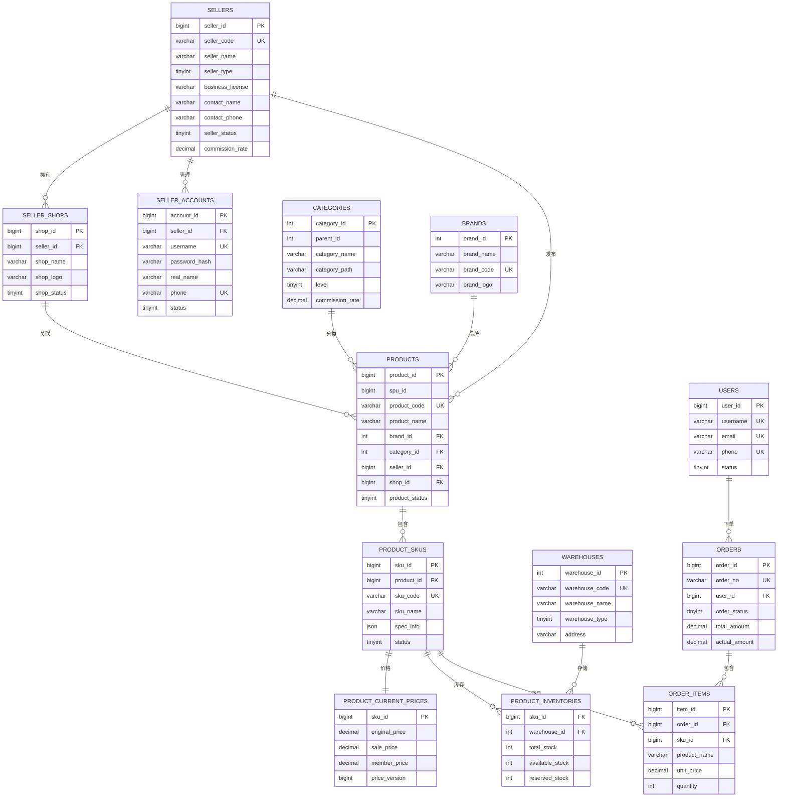

---

## 5. 索引设计策略

### 5.1 索引设计原则

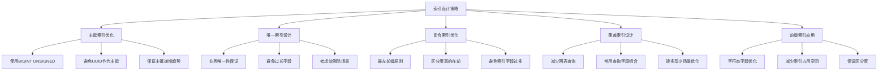

#### 5.1.1 索引优化策略

```sql
-- 商品表关键索引
ALTER TABLE products 
ADD INDEX idx_category_brand_status (category_id, brand_id, status),
ADD INDEX idx_seller_status_created (seller_id, status, created_at),
ADD INDEX idx_status_updated (status, updated_at),
ADD FULLTEXT INDEX ft_search (product_name, description);

-- SKU表关键索引
ALTER TABLE product_skus
ADD INDEX idx_product_status (product_id, status),
ADD INDEX idx_status_updated (status, updated_at);

-- 价格表索引（支持高频查询）
ALTER TABLE product_current_prices
ADD INDEX idx_price_range (sale_price),
ADD INDEX idx_member_price (member_price),
ADD INDEX idx_updated_version (updated_at, version);

-- 库存表索引
ALTER TABLE product_inventories
ADD INDEX idx_available_safe (available_stock, safe_stock),
ADD INDEX idx_warehouse_available (warehouse_id, available_stock);
```

#### 5.1.2 商品搜索索引设计

### 5.2 查询优化示例

```sql
-- 优化前：全表扫描
SELECT p.product_id, p.product_name, pc.sale_price, pi.available_stock
FROM products p
LEFT JOIN product_current_prices pc ON p.product_id = pc.sku_id
LEFT JOIN product_inventories pi ON p.product_id = pi.sku_id
WHERE p.category_id = 1001
AND p.status = 1
AND pc.sale_price BETWEEN 100 AND 500
ORDER BY p.created_at DESC
LIMIT 20;

-- 优化后：使用覆盖索引
-- 创建覆盖索引
CREATE INDEX idx_category_status_created_cover 
ON products (category_id, status, created_at, product_id, product_name);

-- 优化查询
SELECT p.product_id, p.product_name, pc.sale_price, pi.available_stock
FROM products p
INNER JOIN product_current_prices pc ON p.product_id = pc.sku_id
INNER JOIN product_inventories pi ON p.product_id = pi.sku_id
WHERE p.category_id = 1001
AND p.status = 1
AND pc.sale_price BETWEEN 100 AND 500
AND pi.available_stock > 0
ORDER BY p.created_at DESC
LIMIT 20;
```

#### 5.2.1 商品列表查询优化

---

## 6. 数据流转流程

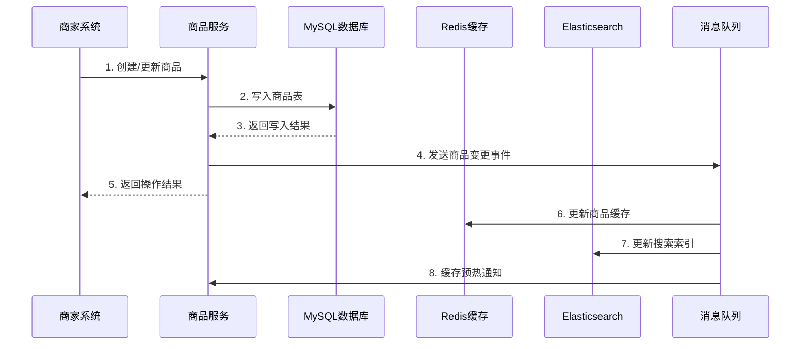

### 6.1 商品数据流转

### 6.2 订单数据流转

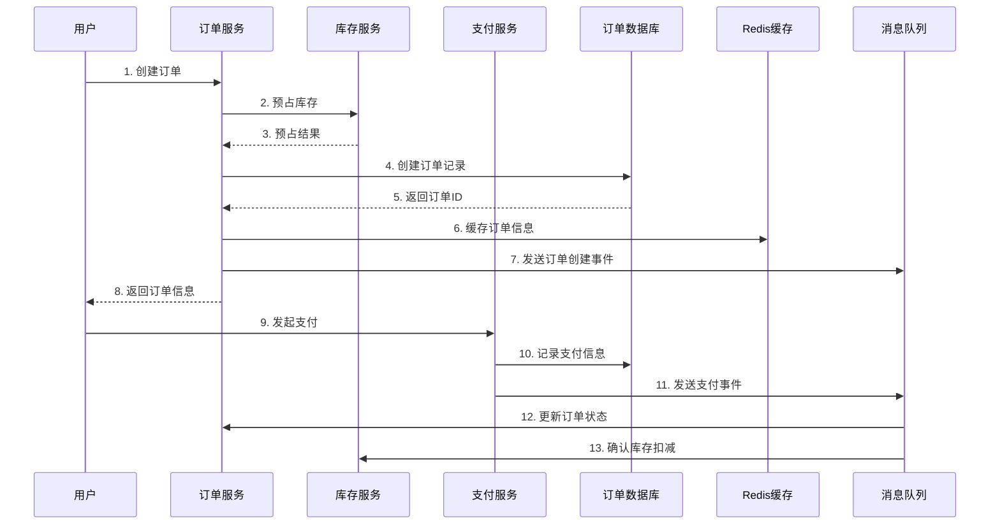

### 6.3 库存数据流转

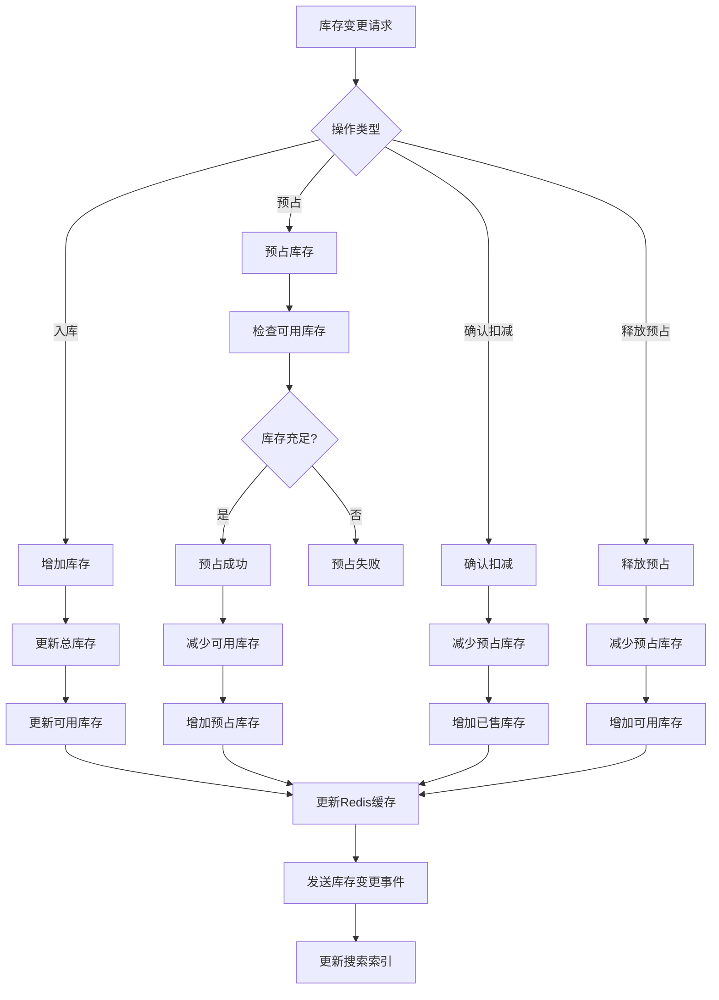

### 6.4 商家后台操作流程

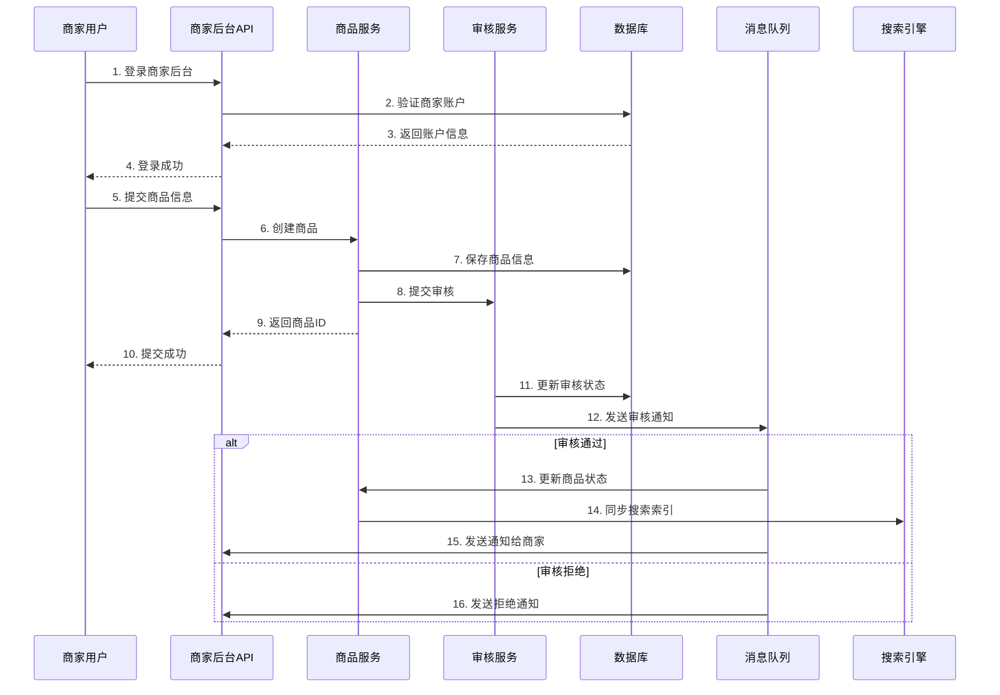
    participant InventoryAPI as 库存服务
    participant PaymentAPI as 支付服务
    participant MySQL as 订单数据库
    participant Redis as Redis缓存
    participant MQ as 消息队列
    
    User->>OrderAPI: 1. 创建订单
    OrderAPI->>InventoryAPI: 2. 预占库存
    InventoryAPI-->>OrderAPI: 3. 预占结果
    OrderAPI->>MySQL: 4. 创建订单记录
    MySQL-->>OrderAPI: 5. 返回订单ID
    OrderAPI->>Redis: 6. 缓存订单信息
    OrderAPI->>MQ: 7. 发送订单创建事件
    OrderAPI-->>User: 8. 返回订单信息
    
    User->>PaymentAPI: 9. 发起支付
    PaymentAPI->>MySQL: 10. 记录支付信息
    PaymentAPI->>MQ: 11. 发送支付事件
    MQ->>OrderAPI: 12. 更新订单状态
    MQ->>InventoryAPI: 13. 确认库存扣减
```

### 6.2 订单数据流转


### 6.3 库存数据流转

---

## 7. 数据一致性保证

### 7.1 分布式事务处理

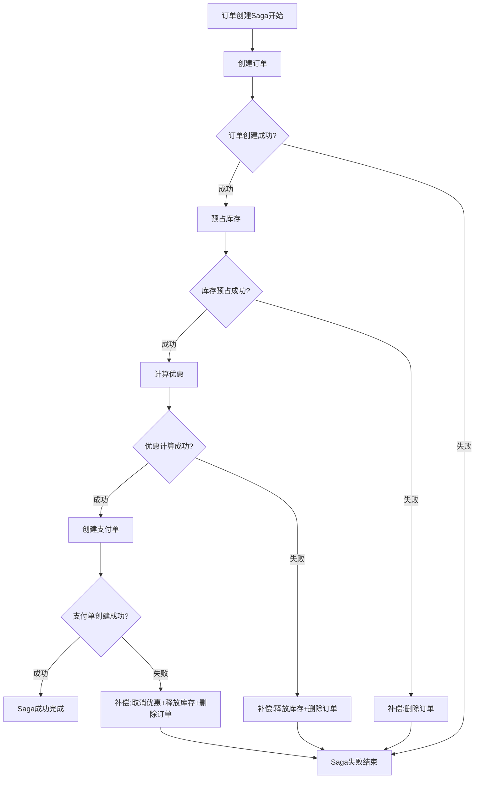

#### 7.1.1 Saga分布式事务模式

```go
// Saga事务管理器
type SagaManager struct {
    steps []SagaStep
    compensations []CompensationStep
}

type SagaStep interface {
    Execute(ctx context.Context) error
    GetCompensation() CompensationStep
}

type CompensationStep interface {
    Compensate(ctx context.Context) error
}

// 订单创建Saga实现
type CreateOrderSaga struct {
    orderID string
    userID  string
    items   []OrderItem
}

func (s *CreateOrderSaga) Execute(ctx context.Context) error {
    saga := &SagaManager{}
    
    // 添加Saga步骤
    saga.AddStep(&CreateOrderStep{orderID: s.orderID, userID: s.userID})
    saga.AddStep(&ReserveInventoryStep{orderID: s.orderID, items: s.items})
    saga.AddStep(&CalculateDiscountStep{orderID: s.orderID})
    saga.AddStep(&CreatePaymentStep{orderID: s.orderID})
    
    return saga.Execute(ctx)
}

func (sm *SagaManager) Execute(ctx context.Context) error {
    executedSteps := make([]int, 0)
    
    for i, step := range sm.steps {
        if err := step.Execute(ctx); err != nil {
            // 执行失败，开始补偿
            sm.compensate(ctx, executedSteps)
            return err
        }
        executedSteps = append(executedSteps, i)
    }
    
    return nil
}

func (sm *SagaManager) compensate(ctx context.Context, executedSteps []int) {
    // 逆序执行补偿操作
    for i := len(executedSteps) - 1; i >= 0; i-- {
        stepIndex := executedSteps[i]
        compensation := sm.steps[stepIndex].GetCompensation()
        if err := compensation.Compensate(ctx); err != nil {
            // 记录补偿失败，需要人工介入
            log.Errorf("Compensation failed for step %d: %v", stepIndex, err)
        }
    }
}
```

#### 7.1.2 最终一致性实现

### 7.2 数据同步策略

```go
// Binlog同步处理器
type BinlogProcessor struct {
    canal   *canal.Canal
    redis   *redis.Client
    es      *elasticsearch.Client
    kafka   *kafka.Writer
}

func (bp *BinlogProcessor) OnRow(e *canal.RowsEvent) error {
    switch e.Table.Name {
    case "products":
        return bp.handleProductChange(e)
    case "product_current_prices":
        return bp.handlePriceChange(e)
    case "product_inventories":
        return bp.handleInventoryChange(e)
    }
    return nil
}

func (bp *BinlogProcessor) handleProductChange(e *canal.RowsEvent) error {
    for _, row := range e.Rows {
        product := bp.parseProduct(row)
        
        // 异步更新缓存
        go bp.updateProductCache(product)
        
        // 异步更新搜索索引
        go bp.updateSearchIndex(product)
        
        // 发送变更事件
        event := ProductChangeEvent{
            ProductID: product.ID,
            Action:    e.Action,
            Timestamp: time.Now(),
        }
        bp.publishEvent("product-change", event)
    }
    return nil
}

func (bp *BinlogProcessor) updateProductCache(product *Product) error {
    key := fmt.Sprintf("product:%d", product.ID)
    data, _ := json.Marshal(product)
    return bp.redis.Set(context.Background(), key, data, time.Hour).Err()
}
```

#### 7.2.1 Binlog数据同步

---

## 8. Go语言实现示例

### 8.1 数据访问层实现

```go
// 分片路由器
type ShardRouter struct {
    dbConfigs map[string]*gorm.DB
    shardRule ShardRule
}

type ShardRule interface {
    Route(shardKey interface{}) (dbName string, tableName string)
}

// 用户分片规则
type UserShardRule struct {
    dbCount    int
    tableCount int
}

func (r *UserShardRule) Route(shardKey interface{}) (string, string) {
    userID := shardKey.(int64)
    dbIndex := userID % int64(r.dbCount)
    tableIndex := userID % int64(r.tableCount)
    
    dbName := fmt.Sprintf("user_db_%d", dbIndex)
    tableName := fmt.Sprintf("users_%d", tableIndex)
    
    return dbName, tableName
}

// 数据访问对象
type UserDAO struct {
    router *ShardRouter
}

func (dao *UserDAO) GetByID(userID int64) (*User, error) {
    dbName, tableName := dao.router.shardRule.Route(userID)
    db := dao.router.dbConfigs[dbName]
    
    var user User
    err := db.Table(tableName).Where("user_id = ?", userID).First(&user).Error
    if err != nil {
        return nil, err
    }
    
    return &user, nil
}

func (dao *UserDAO) Create(user *User) error {
    dbName, tableName := dao.router.shardRule.Route(user.UserID)
    db := dao.router.dbConfigs[dbName]
    
    return db.Table(tableName).Create(user).Error
}
```

#### 8.1.1 分库分表路由

```go
// 多级缓存管理器
type CacheManager struct {
    localCache  *freecache.Cache  // L1本地缓存
    redisClient *redis.Client     // L2分布式缓存
}

func NewCacheManager(redisClient *redis.Client) *CacheManager {
    return &CacheManager{
        localCache:  freecache.NewCache(100 * 1024 * 1024), // 100MB本地缓存
        redisClient: redisClient,
    }
}

func (cm *CacheManager) Get(key string) ([]byte, error) {
    // 先查本地缓存
    if data, err := cm.localCache.Get([]byte(key)); err == nil {
        return data, nil
    }
    
    // 查Redis缓存
    data, err := cm.redisClient.Get(context.Background(), key).Bytes()
    if err != nil {
        return nil, err
    }
    
    // 回写本地缓存
    cm.localCache.Set([]byte(key), data, 300) // 5分钟过期
    
    return data, nil
}

func (cm *CacheManager) Set(key string, value []byte, expiration time.Duration) error {
    // 同时写入两级缓存
    cm.localCache.Set([]byte(key), value, int(expiration.Seconds()))
    return cm.redisClient.Set(context.Background(), key, value, expiration).Err()
}

// 商品缓存服务
type ProductCacheService struct {
    cache *CacheManager
}

func (pcs *ProductCacheService) GetProduct(productID int64) (*Product, error) {
    key := fmt.Sprintf("product:%d", productID)
    
    data, err := pcs.cache.Get(key)
    if err != nil {
        return nil, err
    }
    
    var product Product
    if err := json.Unmarshal(data, &product); err != nil {
        return nil, err
    }
    
    return &product, nil
}

func (pcs *ProductCacheService) SetProduct(product *Product) error {
    key := fmt.Sprintf("product:%d", product.ID)
    data, _ := json.Marshal(product)
    
    return pcs.cache.Set(key, data, time.Hour)
}
```

#### 8.1.2 缓存层实现

### 8.2 高并发处理实现

```go
// 工作协程池
type WorkerPool struct {
    workerCount int
    jobQueue    chan Job
    workers     []*Worker
    quit        chan bool
}

type Job interface {
    Execute() error
}

type Worker struct {
    id       int
    jobQueue chan Job
    quit     chan bool
}

func NewWorkerPool(workerCount, queueSize int) *WorkerPool {
    return &WorkerPool{
        workerCount: workerCount,
        jobQueue:    make(chan Job, queueSize),
        workers:     make([]*Worker, workerCount),
        quit:        make(chan bool),
    }
}

func (wp *WorkerPool) Start() {
    for i := 0; i < wp.workerCount; i++ {
        worker := &Worker{
            id:       i,
            jobQueue: wp.jobQueue,
            quit:     make(chan bool),
        }
        wp.workers[i] = worker
        go worker.start()
    }
}

func (w *Worker) start() {
    for {
        select {
        case job := <-w.jobQueue:
            if err := job.Execute(); err != nil {
                log.Errorf("Worker %d job execution failed: %v", w.id, err)
            }
        case <-w.quit:
            return
        }
    }
}

// 库存扣减任务
type InventoryDeductJob struct {
    SkuID    int64
    Quantity int
    OrderID  string
    dao      *InventoryDAO
}

func (job *InventoryDeductJob) Execute() error {
    return job.dao.DeductInventory(job.SkuID, job.Quantity, job.OrderID)
}
```

#### 8.2.1 协程池实现

```go
// Redis分布式锁
type DistributedLock struct {
    redis  *redis.Client
    key    string
    value  string
    expiry time.Duration
}

func NewDistributedLock(redis *redis.Client, key string, expiry time.Duration) *DistributedLock {
    return &DistributedLock{
        redis:  redis,
        key:    key,
        value:  generateLockValue(),
        expiry: expiry,
    }
}

func (dl *DistributedLock) TryLock(ctx context.Context) (bool, error) {
    result, err := dl.redis.SetNX(ctx, dl.key, dl.value, dl.expiry).Result()
    return result, err
}

func (dl *DistributedLock) Unlock(ctx context.Context) error {
    // Lua脚本保证原子性
    script := `
        if redis.call("get", KEYS[1]) == ARGV[1] then
            return redis.call("del", KEYS[1])
        else
            return 0
        end
    `
    _, err := dl.redis.Eval(ctx, script, []string{dl.key}, dl.value).Result()
    return err
}

// 库存操作使用分布式锁
func (dao *InventoryDAO) DeductInventoryWithLock(skuID int64, quantity int) error {
    lockKey := fmt.Sprintf("lock:inventory:%d", skuID)
    lock := NewDistributedLock(dao.redis, lockKey, time.Second*10)
    
    ctx := context.Background()
    acquired, err := lock.TryLock(ctx)
    if err != nil {
        return err
    }
    if !acquired {
        return errors.New("failed to acquire lock")
    }
    defer lock.Unlock(ctx)
    
    // 执行库存扣减逻辑
    return dao.deductInventory(skuID, quantity)
}
```

#### 8.2.2 分布式锁实现

---

## 9. 性能优化策略

### 9.1 查询优化

```go
// 慢查询监控中间件
type QueryMonitor struct {
    threshold time.Duration
    logger    *logrus.Logger
}

func (qm *QueryMonitor) MonitorQuery(query string, args []interface{}, duration time.Duration) {
    if duration > qm.threshold {
        qm.logger.WithFields(logrus.Fields{
            "query":    query,
            "args":     args,
            "duration": duration.Milliseconds(),
        }).Warn("Slow query detected")
    }
}

// GORM回调函数
func RegisterQueryMonitor(db *gorm.DB, monitor *QueryMonitor) {
    db.Callback().Query().Before("gorm:query").Register("monitor:before", func(db *gorm.DB) {
        db.Set("start_time", time.Now())
    })
    
    db.Callback().Query().After("gorm:query").Register("monitor:after", func(db *gorm.DB) {
        if startTime, exists := db.Get("start_time"); exists {
            duration := time.Since(startTime.(time.Time))
            monitor.MonitorQuery(db.Statement.SQL.String(), db.Statement.Vars, duration)
        }
    })
}
```

#### 9.1.1 慢查询监控

```go
// 数据库连接池配置
func setupDatabasePool(dsn string) *gorm.DB {
    db, err := gorm.Open(mysql.Open(dsn), &gorm.Config{
        Logger: logger.Default.LogMode(logger.Info),
    })
    if err != nil {
        log.Fatal("Failed to connect to database:", err)
    }
    
    sqlDB, _ := db.DB()
    
    // 设置连接池参数
    sqlDB.SetMaxIdleConns(10)                  // 最大空闲连接数
    sqlDB.SetMaxOpenConns(100)                 // 最大打开连接数
    sqlDB.SetConnMaxLifetime(time.Hour)        // 连接最大生命周期
    sqlDB.SetConnMaxIdleTime(time.Minute * 10) // 连接最大空闲时间
    
    return db
}
```

#### 9.1.2 连接池优化

### 9.2 缓存优化

```go
// 防缓存击穿的单飞模式
type SafeCache struct {
    cache  *redis.Client
    group  *singleflight.Group
    local  *freecache.Cache
}

func NewSafeCache(redis *redis.Client) *SafeCache {
    return &SafeCache{
        cache: redis,
        group: &singleflight.Group{},
        local: freecache.NewCache(50 * 1024 * 1024),
    }
}

func (sc *SafeCache) GetWithSingleFlight(key string, loader func() (interface{}, error)) (interface{}, error) {
    // 先查本地缓存
    if data, err := sc.local.Get([]byte(key)); err == nil {
        var result interface{}
        json.Unmarshal(data, &result)
        return result, nil
    }
    
    // 使用singleflight防止缓存击穿
    v, err, _ := sc.group.Do(key, func() (interface{}, error) {
        // 查Redis
        data, err := sc.cache.Get(context.Background(), key).Result()
        if err == redis.Nil {
            // 缓存不存在，调用加载函数
            result, err := loader()
            if err != nil {
                return nil, err
            }
            
            // 写入缓存
            resultData, _ := json.Marshal(result)
            sc.cache.Set(context.Background(), key, resultData, time.Hour)
            sc.local.Set([]byte(key), resultData, 300)
            
            return result, nil
        } else if err != nil {
            return nil, err
        }
        
        var result interface{}
        json.Unmarshal([]byte(data), &result)
        
        // 回写本地缓存
        sc.local.Set([]byte(key), []byte(data), 300)
        
        return result, nil
    })
    
    return v, err
}
```

#### 9.2.1 缓存击穿防护

### 9.3 性能监控指标

```go
// 性能指标收集
type MetricsCollector struct {
    queryDuration    prometheus.HistogramVec
    cacheHitRate     prometheus.GaugeVec
    connectionPool   prometheus.GaugeVec
    errorRate        prometheus.CounterVec
}

func NewMetricsCollector() *MetricsCollector {
    return &MetricsCollector{
        queryDuration: *prometheus.NewHistogramVec(
            prometheus.HistogramOpts{
                Name: "db_query_duration_seconds",
                Help: "Database query duration",
            },
            []string{"table", "operation"},
        ),
        cacheHitRate: *prometheus.NewGaugeVec(
            prometheus.GaugeOpts{
                Name: "cache_hit_rate",
                Help: "Cache hit rate",
            },
            []string{"cache_type"},
        ),
    }
}

// 验收标准和性能目标
const (
    // 查询性能目标
    MaxQueryDuration     = 100 * time.Millisecond  // 单表查询<100ms
    MaxComplexQueryTime  = 500 * time.Millisecond  // 复杂查询<500ms
    
    // 缓存性能目标
    MinCacheHitRate     = 0.95  // 缓存命中率>95%
    MaxCacheMissLatency = 10 * time.Millisecond
    
    // 并发性能目标
    MaxConcurrentQPS    = 100000  // 最大并发QPS
    MaxConnectionPool   = 1000    // 最大连接池大小
)
```

---

## 验收标准

### 功能验收标准
- [ ] 支持千万级用户数据的分库分表
- [ ] 支持亿级商品数据的高效查询
- [ ] 支持每秒10万+的读写QPS
- [ ] 单表查询响应时间<100ms
- [ ] 缓存命中率>95%
- [ ] 分布式事务成功率>99.9%

### 性能验收标准
- [ ] 数据库连接池利用率<80%
- [ ] Redis内存使用率<80%
- [ ] 慢查询比例<0.1%
- [ ] 数据同步延迟<1s
- [ ] 系统可用性>99.99%

### 扩展性验收标准
- [ ] 支持在线扩容和缩容
- [ ] 支持热点数据自动迁移
- [ ] 支持多机房部署
- [ ] 支持灰度发布