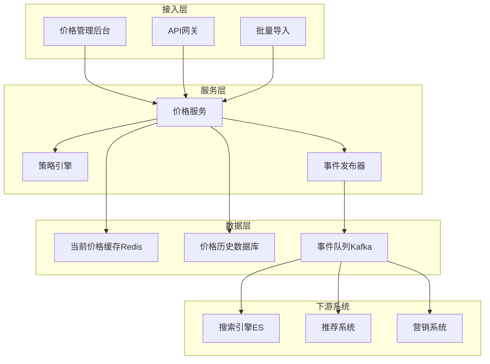
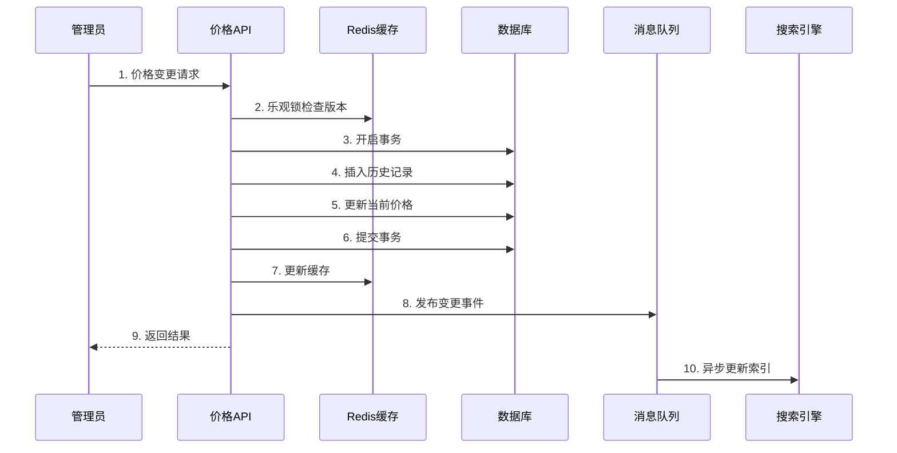
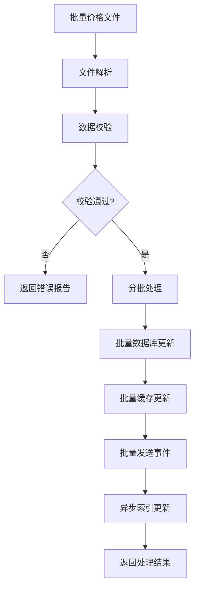
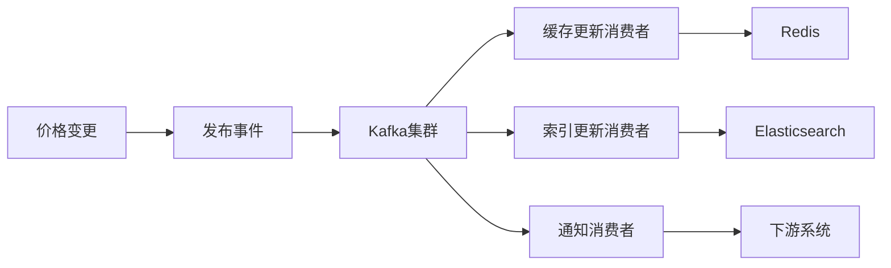
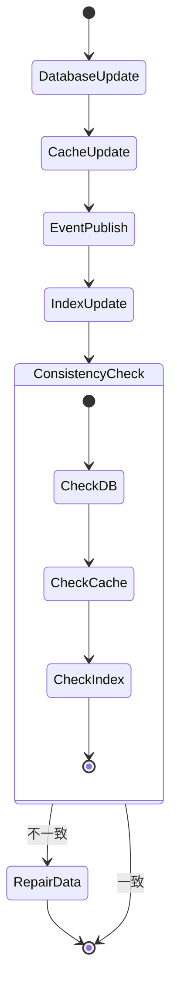
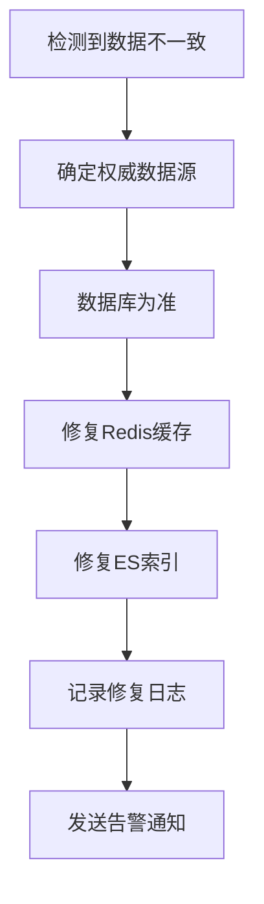
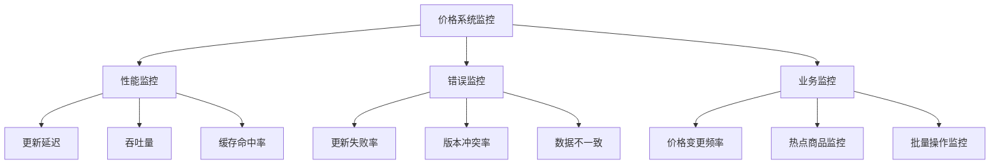

# 千亿级电商系统 - 商品价格频繁变动处理逻辑与流程图

## 目录

- [1. 价格系统架构设计](#1-价格系统架构设计)
- [2. 高频价格更新技术方案](#2-高频价格更新技术方案)
- [3. 价格数据一致性保证](#3-价格数据一致性保证)
- [4. Go语言核心实现](#4-go语言核心实现)
- [5. 性能监控与运维](#5-性能监控与运维)

---

## 1. 价格系统架构设计

### 1.1 整体架构



### 1.2 价格表结构设计

```sql
-- 当前生效价格表（热数据）
CREATE TABLE `product_current_prices` (
    `sku_id` BIGINT UNSIGNED NOT NULL,
    `original_price` DECIMAL(12,2) NOT NULL,
    `sale_price` DECIMAL(12,2) NOT NULL,
    `member_price` DECIMAL(12,2) NULL,
    `currency` VARCHAR(3) NOT NULL DEFAULT 'CNY',
    `price_version` BIGINT UNSIGNED NOT NULL DEFAULT 1,
    `effective_time` TIMESTAMP NOT NULL,
    `updated_at` TIMESTAMP NOT NULL DEFAULT CURRENT_TIMESTAMP ON UPDATE CURRENT_TIMESTAMP,
    PRIMARY KEY (`sku_id`),
    KEY `idx_price_version` (`price_version`),
    KEY `idx_updated_at` (`updated_at`)
) ENGINE=InnoDB COMMENT='当前生效价格表';

-- 价格变更历史表（冷数据）
CREATE TABLE `product_price_history` (
    `history_id` BIGINT UNSIGNED NOT NULL AUTO_INCREMENT,
    `sku_id` BIGINT UNSIGNED NOT NULL,
    `old_price` DECIMAL(12,2) NULL,
    `new_price` DECIMAL(12,2) NOT NULL,
    `change_reason` VARCHAR(200) NULL,
    `price_version` BIGINT UNSIGNED NOT NULL,
    `operator_id` BIGINT UNSIGNED NOT NULL,
    `created_at` TIMESTAMP NOT NULL DEFAULT CURRENT_TIMESTAMP,
    PRIMARY KEY (`history_id`),
    KEY `idx_sku_created` (`sku_id`, `created_at`)
) ENGINE=InnoDB COMMENT='价格变更历史表';
```

---

## 2. 高频价格更新技术方案

### 2.1 价格更新主流程



### 2.2 批量价格更新流程



### 2.3 事件驱动架构



---

## 3. 价格数据一致性保证

### 3.1 数据一致性策略



### 3.2 补偿机制



---

## 4. Go语言核心实现

### 4.1 价格服务核心代码

```go
// 价格服务主结构
type PriceService struct {
    db          *gorm.DB
    redis       *redis.Client
    kafka       *kafka.Writer
    rateLimiter *rate.Limiter
}

// 乐观锁更新价格
func (ps *PriceService) UpdatePrice(ctx context.Context, req *PriceUpdateRequest) error {
    // 1. 获取当前版本
    currentVersion, err := ps.getCurrentVersion(ctx, req.SkuID)
    if err != nil {
        return err
    }
    
    // 2. 版本冲突检查
    if currentVersion != req.ExpectedVersion {
        return errors.New("version conflict")
    }
    
    // 3. 数据库更新
    newVersion := currentVersion + 1
    err = ps.db.Transaction(func(tx *gorm.DB) error {
        // 插入历史记录
        history := &PriceHistory{
            SkuID:       req.SkuID,
            OldPrice:    req.OldPrice,
            NewPrice:    req.NewPrice,
            Version:     newVersion,
            OperatorID:  req.OperatorID,
        }
        if err := tx.Create(history).Error; err != nil {
            return err
        }
        
        // 更新当前价格
        current := &ProductCurrentPrice{
            SkuID:       req.SkuID,
            SalePrice:   req.NewPrice,
            Version:     newVersion,
            UpdatedAt:   time.Now(),
        }
        return tx.Save(current).Error
    })
    
    if err != nil {
        return err
    }
    
    // 4. 更新缓存
    if err := ps.updateCache(ctx, req.SkuID, req.NewPrice, newVersion); err != nil {
        log.Errorf("Failed to update cache: %v", err)
    }
    
    // 5. 发布事件
    event := &PriceChangeEvent{
        SkuID:     req.SkuID,
        OldPrice:  req.OldPrice,
        NewPrice:  req.NewPrice,
        Version:   newVersion,
        Timestamp: time.Now(),
    }
    
    return ps.publishEvent(ctx, event)
}

// 批量价格更新
func (ps *PriceService) BatchUpdatePrices(ctx context.Context, updates []*PriceUpdateRequest) error {
    // 分批处理，避免单次事务过大
    batchSize := 1000
    for i := 0; i < len(updates); i += batchSize {
        end := i + batchSize
        if end > len(updates) {
            end = len(updates)
        }
        
        batch := updates[i:end]
        if err := ps.processBatch(ctx, batch); err != nil {
            return fmt.Errorf("batch %d-%d failed: %v", i, end, err)
        }
    }
    
    return nil
}

// 缓存更新
func (ps *PriceService) updateCache(ctx context.Context, skuID int64, price decimal.Decimal, version int64) error {
    key := fmt.Sprintf("price:current:%d", skuID)
    data := map[string]interface{}{
        "sale_price":    price.String(),
        "price_version": version,
        "updated_at":    time.Now().Unix(),
    }
    
    return ps.redis.HMSet(ctx, key, data).Err()
}

// 事件发布
func (ps *PriceService) publishEvent(ctx context.Context, event *PriceChangeEvent) error {
    data, _ := json.Marshal(event)
    
    message := kafka.Message{
        Topic: "price-change",
        Key:   []byte(fmt.Sprintf("%d", event.SkuID)),
        Value: data,
    }
    
    return ps.kafka.WriteMessages(ctx, message)
}
```

### 4.2 高并发处理

```go
// 价格更新限流器
type PriceRateLimiter struct {
    limiters map[int64]*rate.Limiter
    mutex    sync.RWMutex
}

func (prl *PriceRateLimiter) Allow(skuID int64) bool {
    prl.mutex.RLock()
    limiter, exists := prl.limiters[skuID]
    prl.mutex.RUnlock()
    
    if !exists {
        prl.mutex.Lock()
        limiter = rate.NewLimiter(rate.Limit(10), 10) // 每秒10次更新
        prl.limiters[skuID] = limiter
        prl.mutex.Unlock()
    }
    
    return limiter.Allow()
}

// 协程池处理价格更新
type PriceUpdateWorkerPool struct {
    workerCount int
    jobQueue    chan *PriceUpdateJob
    workers     []*PriceUpdateWorker
}

type PriceUpdateJob struct {
    SkuID    int64
    NewPrice decimal.Decimal
    Callback func(error)
}

func (pool *PriceUpdateWorkerPool) Submit(job *PriceUpdateJob) {
    select {
    case pool.jobQueue <- job:
    default:
        // 队列满时的处理策略
        job.Callback(errors.New("worker pool is full"))
    }
}
```

---

## 5. 性能监控与运维

### 5.1 关键性能指标

```go
// 性能指标收集
type PriceMetrics struct {
    updateLatency     prometheus.HistogramVec
    updateThroughput  prometheus.CounterVec
    cacheHitRate      prometheus.GaugeVec
    versionConflicts  prometheus.CounterVec
}

// 监控指标定义
var (
    PriceUpdateDuration = prometheus.NewHistogramVec(
        prometheus.HistogramOpts{
            Name: "price_update_duration_seconds",
            Help: "Price update duration",
        },
        []string{"operation"},
    )
    
    PriceUpdateTotal = prometheus.NewCounterVec(
        prometheus.CounterOpts{
            Name: "price_update_total",
            Help: "Total price updates",
        },
        []string{"status"},
    )
)
```

### 5.2 运维监控



---

## 验收标准

### 功能验收标准
- [ ] 支持单个商品价格秒级更新
- [ ] 支持批量价格更新（万级别）
- [ ] 价格历史完整记录
- [ ] 版本冲突正确处理
- [ ] 数据最终一致性保证

### 性能验收标准
- [ ] 单次价格更新响应时间 < 50ms
- [ ] 批量更新吞吐量 > 1万/秒
- [ ] 缓存命中率 > 95%
- [ ] 数据一致性延迟 < 1秒
- [ ] 系统可用性 > 99.9%

### 可靠性验收标准
- [ ] 价格更新失败率 < 0.1%
- [ ] 版本冲突处理正确率 100%
- [ ] 数据修复成功率 > 99%
- [ ] 告警响应时间 < 1分钟