# 千亿级电商系统 - 用户搜索整体流程图

## 目录

- [1. 搜索系统架构设计](#1-搜索系统架构设计)
- [2. 搜索请求完整流程](#2-搜索请求完整流程)
- [3. 搜索性能优化策略](#3-搜索性能优化策略)
- [4. Go语言搜索实现](#4-go语言搜索实现)
- [5. 搜索运营与监控](#5-搜索运营与监控)

---

## 1. 搜索系统架构设计

### 1.1 整体架构

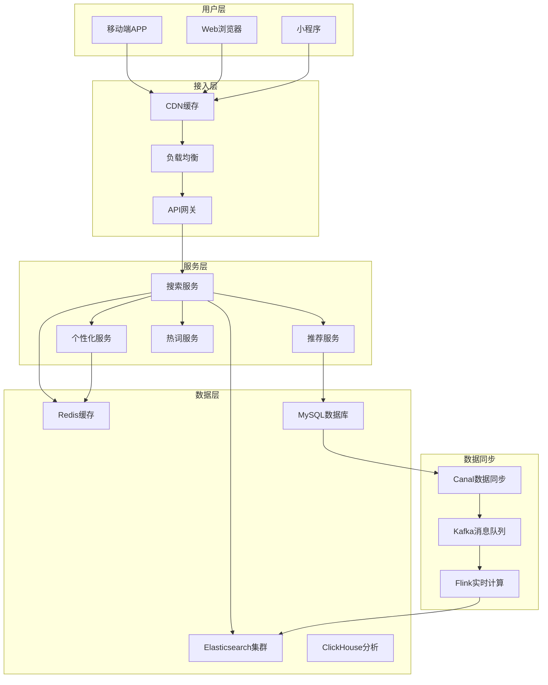

### 1.2 搜索数据流架构

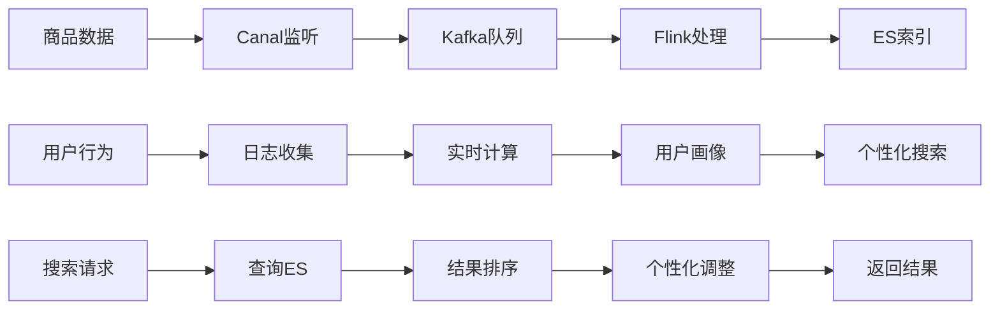

---

## 2. 搜索请求完整流程

### 2.1 搜索主流程

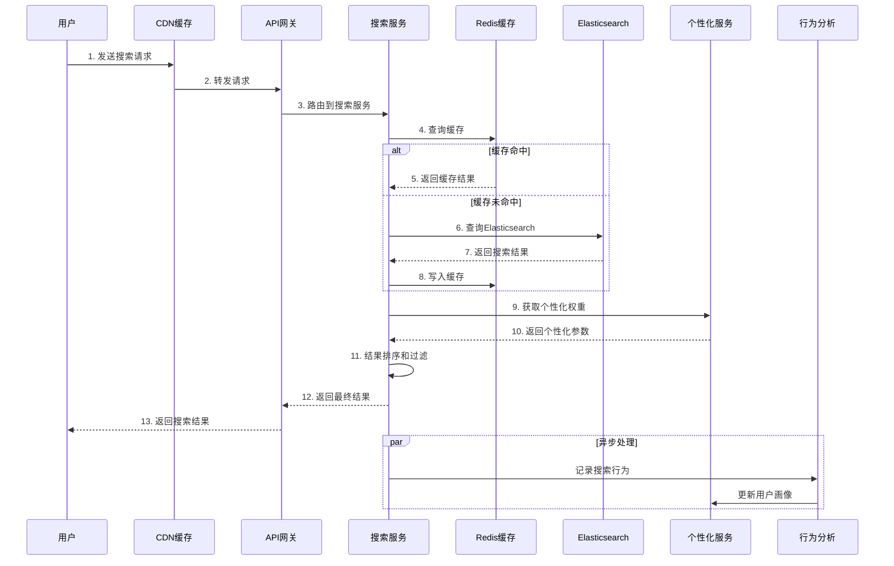

### 2.2 搜索词处理流程

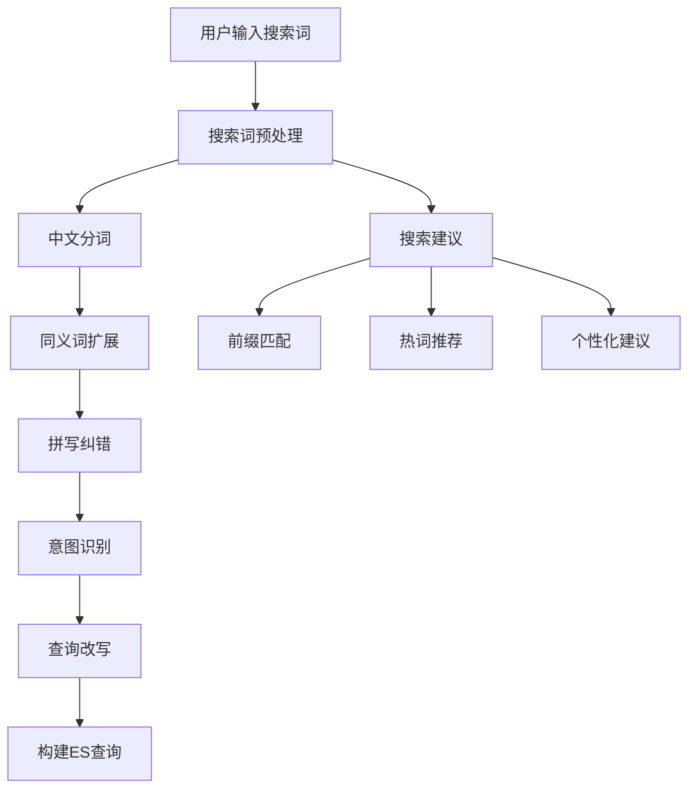

### 2.3 搜索结果处理流程

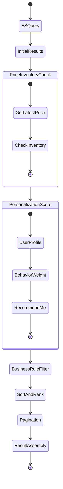

### 2.4 多条件搜索流程

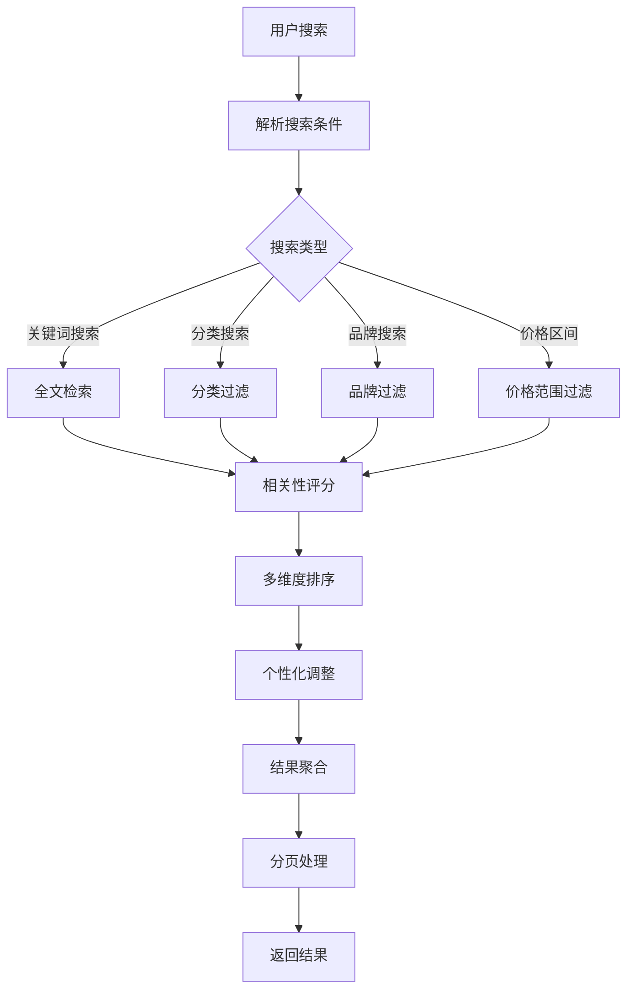

---

## 3. 搜索性能优化策略

### 3.1 多级缓存架构

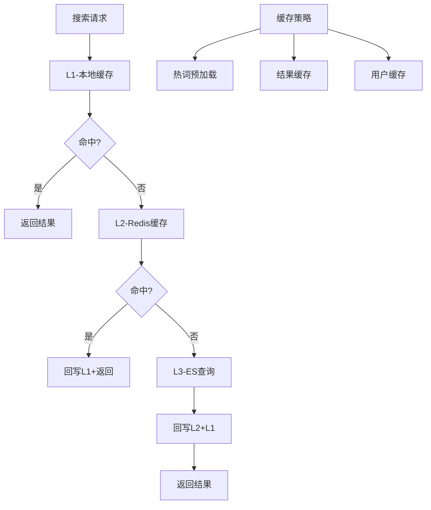

### 3.2 ES索引优化策略

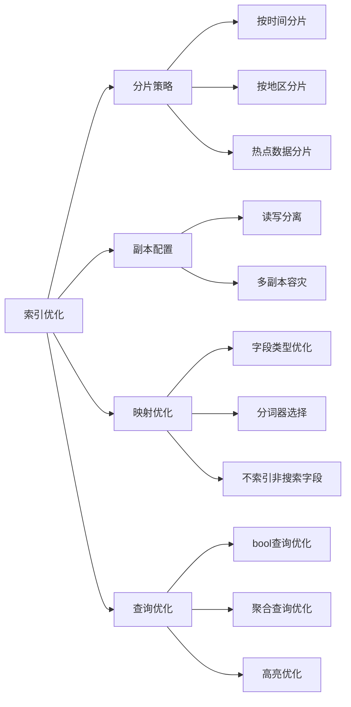

### 3.3 搜索性能监控

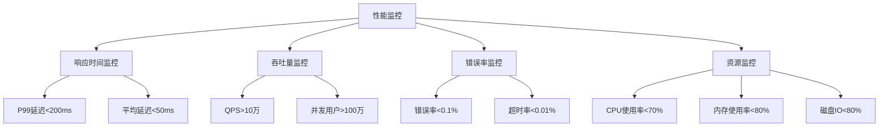

---

## 4. Go语言搜索实现

### 4.1 搜索服务核心实现

```go
// 搜索服务主结构
type SearchService struct {
    esClient    *elasticsearch.Client
    redis       *redis.Client
    localCache  *cache.Cache
    personalSvc *PersonalizationService
    analytics   *AnalyticsService
}

// 搜索请求结构
type SearchRequest struct {
    Query        string            `json:"query"`
    Filters      map[string]interface{} `json:"filters"`
    Sort         []SortField       `json:"sort"`
    Page         int               `json:"page"`
    Size         int               `json:"size"`
    UserID       int64             `json:"user_id"`
    Platform     string            `json:"platform"`
}

// 搜索结果结构
type SearchResponse struct {
    Total       int64           `json:"total"`
    Products    []ProductItem   `json:"products"`
    Aggregations map[string]interface{} `json:"aggregations"`
    Suggestions []string        `json:"suggestions"`
    SearchTime  int64           `json:"search_time"`
}

// 主搜索方法
func (s *SearchService) Search(ctx context.Context, req *SearchRequest) (*SearchResponse, error) {
    startTime := time.Now()
    
    // 1. 参数校验
    if err := s.validateSearchRequest(req); err != nil {
        return nil, err
    }
    
    // 2. 搜索词预处理
    processedQuery, err := s.preprocessQuery(req.Query)
    if err != nil {
        return nil, err
    }
    
    // 3. 缓存查询
    cacheKey := s.generateCacheKey(req)
    if cached, err := s.getFromCache(ctx, cacheKey); err == nil {
        // 异步记录搜索行为
        go s.recordSearchBehavior(ctx, req, cached)
        return cached, nil
    }
    
    // 4. ES查询
    esResp, err := s.searchElasticsearch(ctx, processedQuery, req)
    if err != nil {
        return nil, err
    }
    
    // 5. 个性化处理
    personalizedResp, err := s.applyPersonalization(ctx, esResp, req)
    if err != nil {
        log.Errorf("Personalization failed: %v", err)
        personalizedResp = esResp // 降级处理
    }
    
    // 6. 价格库存实时检查
    finalResp, err := s.enrichWithRealTimeData(ctx, personalizedResp)
    if err != nil {
        return nil, err
    }
    
    // 7. 结果缓存
    finalResp.SearchTime = time.Since(startTime).Milliseconds()
    go s.cacheResult(ctx, cacheKey, finalResp)
    
    // 8. 异步记录行为
    go s.recordSearchBehavior(ctx, req, finalResp)
    
    return finalResp, nil
}

// ES查询实现
func (s *SearchService) searchElasticsearch(ctx context.Context, query string, req *SearchRequest) (*SearchResponse, error) {
    // 构建ES查询
    searchBody := map[string]interface{}{
        "query": s.buildESQuery(query, req.Filters),
        "sort":  s.buildESSort(req.Sort),
        "from":  (req.Page - 1) * req.Size,
        "size":  req.Size,
        "aggs":  s.buildESAggregations(req.Filters),
        "highlight": map[string]interface{}{
            "fields": map[string]interface{}{
                "product_name": map[string]interface{}{},
                "description":  map[string]interface{}{},
            },
        },
    }
    
    // 执行查询
    body, _ := json.Marshal(searchBody)
    resp, err := s.esClient.Search(
        s.esClient.Search.WithContext(ctx),
        s.esClient.Search.WithIndex("products"),
        s.esClient.Search.WithBody(strings.NewReader(string(body))),
        s.esClient.Search.WithTimeout(5*time.Second),
    )
    
    if err != nil {
        return nil, err
    }
    defer resp.Body.Close()
    
    // 解析结果
    return s.parseESResponse(resp)
}

// 构建ES查询
func (s *SearchService) buildESQuery(query string, filters map[string]interface{}) map[string]interface{} {
    mustClauses := []map[string]interface{}{}
    filterClauses := []map[string]interface{}{}
    
    // 主查询
    if query != "" {
        mustClauses = append(mustClauses, map[string]interface{}{
            "multi_match": map[string]interface{}{
                "query": query,
                "fields": []string{
                    "product_name^3",    // 商品名称权重最高
                    "brand^2",           // 品牌权重次之
                    "category_name^1.5", // 分类权重
                    "description",       // 描述权重最低
                },
                "type": "best_fields",
                "operator": "and",
            },
        })
    }
    
    // 过滤条件
    for key, value := range filters {
        switch key {
        case "category_id":
            filterClauses = append(filterClauses, map[string]interface{}{
                "term": map[string]interface{}{
                    "category_id": value,
                },
            })
        case "brand_id":
            filterClauses = append(filterClauses, map[string]interface{}{
                "term": map[string]interface{}{
                    "brand_id": value,
                },
            })
        case "price_range":
            priceRange := value.(map[string]float64)
            filterClauses = append(filterClauses, map[string]interface{}{
                "range": map[string]interface{}{
                    "sale_price": map[string]interface{}{
                        "gte": priceRange["min"],
                        "lte": priceRange["max"],
                    },
                },
            })
        }
    }
    
    // 商品状态过滤
    filterClauses = append(filterClauses, map[string]interface{}{
        "term": map[string]interface{}{
            "status": 1, // 只搜索上架商品
        },
    })
    
    return map[string]interface{}{
        "bool": map[string]interface{}{
            "must":   mustClauses,
            "filter": filterClauses,
        },
    }
}

// 个性化处理
func (s *SearchService) applyPersonalization(ctx context.Context, resp *SearchResponse, req *SearchRequest) (*SearchResponse, error) {
    if req.UserID == 0 {
        return resp, nil // 未登录用户不做个性化
    }
    
    // 获取用户画像
    profile, err := s.personalSvc.GetUserProfile(ctx, req.UserID)
    if err != nil {
        return resp, nil // 获取失败则不做个性化
    }
    
    // 重新排序
    s.reorderByPersonalization(resp.Products, profile)
    
    // 混入推荐商品
    recommendations, _ := s.personalSvc.GetRecommendations(ctx, req.UserID, 5)
    resp.Products = s.mixRecommendations(resp.Products, recommendations)
    
    return resp, nil
}

// 实时数据补充
func (s *SearchService) enrichWithRealTimeData(ctx context.Context, resp *SearchResponse) (*SearchResponse, error) {
    skuIDs := make([]int64, len(resp.Products))
    for i, product := range resp.Products {
        skuIDs[i] = product.SkuID
    }
    
    // 批量获取实时价格
    prices, err := s.batchGetPrices(ctx, skuIDs)
    if err != nil {
        log.Errorf("Failed to get real-time prices: %v", err)
    }
    
    // 批量获取实时库存
    inventories, err := s.batchGetInventories(ctx, skuIDs)
    if err != nil {
        log.Errorf("Failed to get real-time inventories: %v", err)
    }
    
    // 更新商品信息
    for i := range resp.Products {
        if price, exists := prices[resp.Products[i].SkuID]; exists {
            resp.Products[i].SalePrice = price.SalePrice
            resp.Products[i].OriginalPrice = price.OriginalPrice
        }
        
        if inventory, exists := inventories[resp.Products[i].SkuID]; exists {
            resp.Products[i].AvailableStock = inventory.AvailableStock
        }
    }
    
    return resp, nil
}
```

### 4.2 缓存实现

```go
// 多级缓存实现
type MultiLevelCache struct {
    l1Cache *cache.Cache      // 本地缓存
    l2Cache *redis.Client     // Redis缓存
    l3Cache func(string) interface{} // 数据源
}

func (mlc *MultiLevelCache) Get(key string) (interface{}, error) {
    // L1缓存查询
    if value, found := mlc.l1Cache.Get(key); found {
        return value, nil
    }
    
    // L2缓存查询
    value, err := mlc.l2Cache.Get(context.Background(), key).Result()
    if err == nil {
        // 回写L1缓存
        mlc.l1Cache.Set(key, value, cache.DefaultExpiration)
        return value, nil
    }
    
    // L3数据源查询
    value = mlc.l3Cache(key)
    if value != nil {
        // 回写L2和L1缓存
        mlc.l2Cache.Set(context.Background(), key, value, time.Hour)
        mlc.l1Cache.Set(key, value, 10*time.Minute)
    }
    
    return value, nil
}

// 搜索结果缓存策略
func (s *SearchService) generateCacheKey(req *SearchRequest) string {
    h := sha256.New()
    h.Write([]byte(fmt.Sprintf("%s:%v:%v:%d:%d", 
        req.Query, req.Filters, req.Sort, req.Page, req.Size)))
    return fmt.Sprintf("search:%x", h.Sum(nil))
}

func (s *SearchService) getFromCache(ctx context.Context, key string) (*SearchResponse, error) {
    value, err := s.localCache.Get(key)
    if err == nil {
        if resp, ok := value.(*SearchResponse); ok {
            return resp, nil
        }
    }
    
    // Redis缓存
    data, err := s.redis.Get(ctx, key).Bytes()
    if err != nil {
        return nil, err
    }
    
    var resp SearchResponse
    if err := json.Unmarshal(data, &resp); err != nil {
        return nil, err
    }
    
    // 回写本地缓存
    s.localCache.Set(key, &resp, 5*time.Minute)
    
    return &resp, nil
}
```

### 4.3 性能优化

```go
// 搜索性能优化
type SearchOptimizer struct {
    rateLimiter  *rate.Limiter
    circuitBreaker *breaker.CircuitBreaker
    metrics      *SearchMetrics
}

// 限流处理
func (so *SearchOptimizer) RateLimit(userID int64) error {
    if !so.rateLimiter.Allow() {
        so.metrics.RateLimitCounter.Inc()
        return errors.New("rate limit exceeded")
    }
    return nil
}

// 熔断处理
func (so *SearchOptimizer) ExecuteWithCircuitBreaker(fn func() error) error {
    return so.circuitBreaker.Execute(fn)
}

// 并发搜索优化
func (s *SearchService) ConcurrentSearch(ctx context.Context, queries []SearchRequest) ([]*SearchResponse, error) {
    results := make([]*SearchResponse, len(queries))
    errors := make([]error, len(queries))
    
    var wg sync.WaitGroup
    semaphore := make(chan struct{}, 10) // 限制并发数
    
    for i, query := range queries {
        wg.Add(1)
        go func(index int, req SearchRequest) {
            defer wg.Done()
            
            semaphore <- struct{}{}
            defer func() { <-semaphore }()
            
            result, err := s.Search(ctx, &req)
            results[index] = result
            errors[index] = err
        }(i, query)
    }
    
    wg.Wait()
    
    // 检查是否有错误
    for _, err := range errors {
        if err != nil {
            return results, err
        }
    }
    
    return results, nil
}
```

---

## 5. 搜索运营与监控

### 5.1 搜索质量监控

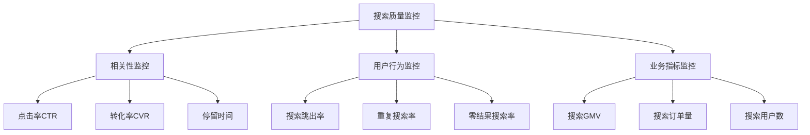

### 5.2 搜索运营策略

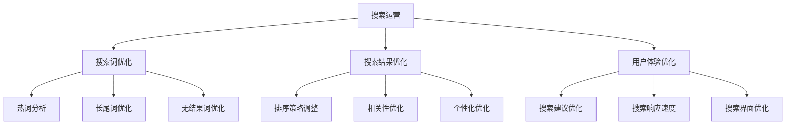

---

## 验收标准

### 功能验收标准
- [ ] 支持全文搜索、分类搜索、筛选搜索
- [ ] 搜索建议和自动补全功能
- [ ] 个性化搜索排序
- [ ] 搜索结果高亮显示
- [ ] 多维度聚合统计

### 性能验收标准
- [ ] 搜索响应时间P99 < 200ms
- [ ] 搜索QPS > 10万
- [ ] 缓存命中率 > 90%
- [ ] 搜索可用性 > 99.9%
- [ ] 并发用户 > 100万

### 质量验收标准
- [ ] 搜索相关性准确率 > 85%
- [ ] 搜索零结果率 < 5%
- [ ] 搜索CTR > 15%
- [ ] 搜索转化率 > 3%
- [ ] 搜索跳出率 < 40%