# 千亿级电商系统 - MVP到千亿级发展路径规划

## 目录

- [1. 发展路径总览](#1-发展路径总览)
- [2. MVP阶段设计](#2-mvp阶段设计)
- [3. 各阶段详细规划](#3-各阶段详细规划)
- [4. 技术架构演进](#4-技术架构演进)
- [5. 团队建设规划](#5-团队建设规划)
- [6. 风险控制策略](#6-风险控制策略)

---

## 1. 发展路径总览

### 1.1 演进时间线

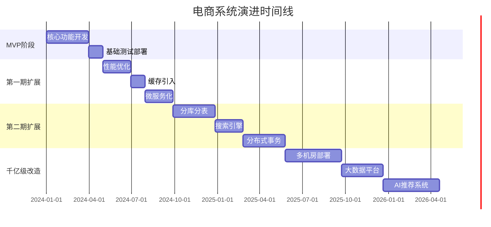

### 1.2 系统能力演进

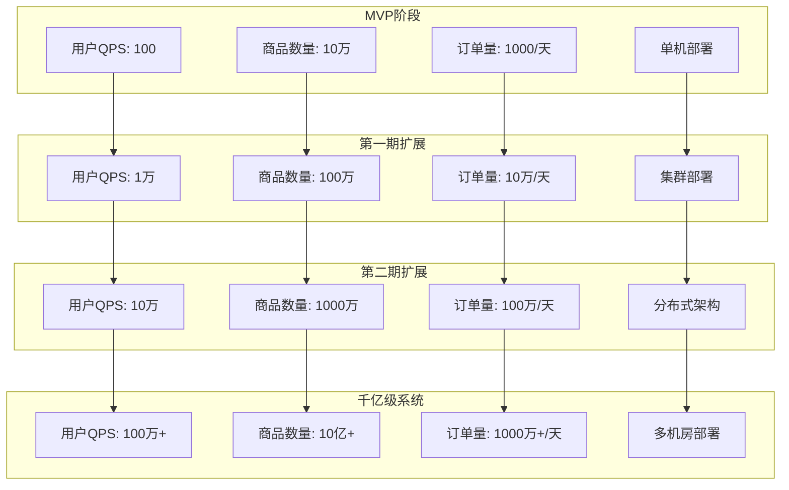

---

## 2. MVP阶段设计

### 2.1 MVP核心功能

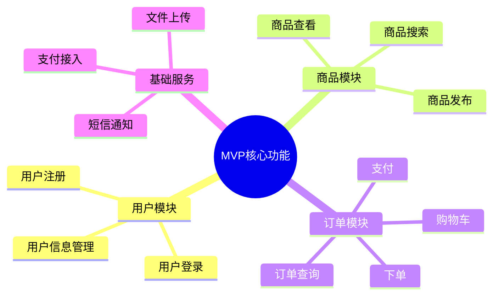

### 2.2 MVP技术架构

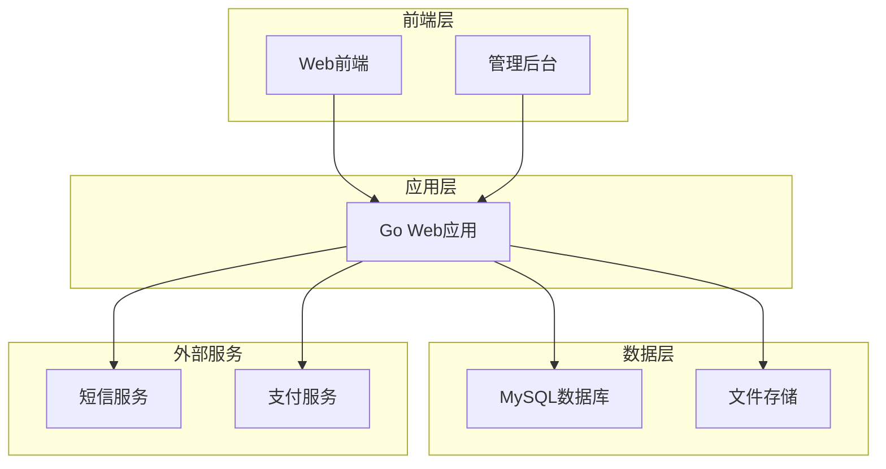

### 2.3 MVP数据模型

``sql
-- MVP阶段简化表结构

-- 用户表
CREATE TABLE users (
    user_id BIGINT PRIMARY KEY AUTO_INCREMENT,
    username VARCHAR(50) UNIQUE NOT NULL,
    password_hash VARCHAR(255) NOT NULL,
    email VARCHAR(100),
    phone VARCHAR(20),
    created_at TIMESTAMP DEFAULT CURRENT_TIMESTAMP
);

-- 商品表
CREATE TABLE products (
    product_id BIGINT PRIMARY KEY AUTO_INCREMENT,
    product_name VARCHAR(200) NOT NULL,
    price DECIMAL(10,2) NOT NULL,
    stock INT NOT NULL DEFAULT 0,
    description TEXT,
    image_url VARCHAR(500),
    status TINYINT DEFAULT 1,
    created_at TIMESTAMP DEFAULT CURRENT_TIMESTAMP
);

-- 订单表
CREATE TABLE orders (
    order_id BIGINT PRIMARY KEY AUTO_INCREMENT,
    user_id BIGINT NOT NULL,
    total_amount DECIMAL(10,2) NOT NULL,
    order_status TINYINT NOT NULL DEFAULT 1,
    created_at TIMESTAMP DEFAULT CURRENT_TIMESTAMP,
    FOREIGN KEY (user_id) REFERENCES users(user_id)
);

-- 订单明细表
CREATE TABLE order_items (
    item_id BIGINT PRIMARY KEY AUTO_INCREMENT,
    order_id BIGINT NOT NULL,
    product_id BIGINT NOT NULL,
    quantity INT NOT NULL,
    price DECIMAL(10,2) NOT NULL,
    FOREIGN KEY (order_id) REFERENCES orders(order_id),
    FOREIGN KEY (product_id) REFERENCES products(product_id)
);
```

### 2.4 MVP开发计划

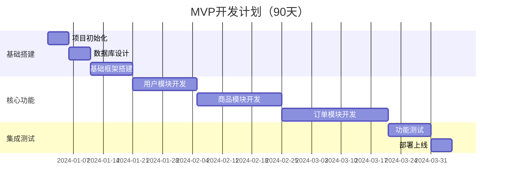

---

## 3. 各阶段详细规划

### 3.1 第一期扩展（3-6个月）

#### 3.1.1 主要目标
- 支持1万QPS
- 引入缓存提升性能
- 实现读写分离
- 微服务化改造

#### 3.1.2 技术升级

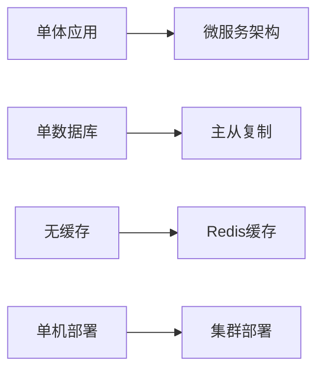

#### 3.1.3 架构演进

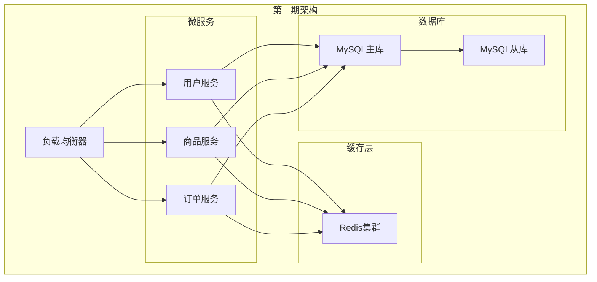

#### 3.1.4 关键任务

| 任务 | 工期 | 验收标准 | 负责团队 |
|------|------|----------|----------|
| Redis缓存集成 | 2周 | 缓存命中率>80% | 后端团队 |
| 数据库读写分离 | 3周 | 读写QPS分离 | DBA团队 |
| 微服务拆分 | 6周 | 服务独立部署 | 架构团队 |
| API网关搭建 | 2周 | 统一接入 | 运维团队 |
| 监控系统 | 3周 | 完整监控指标 | 运维团队 |

### 3.2 第二期扩展（6-12个月）

#### 3.2.1 主要目标
- 支持10万QPS
- 实现分库分表
- 引入搜索引擎
- 分布式事务处理

#### 3.2.2 架构重构

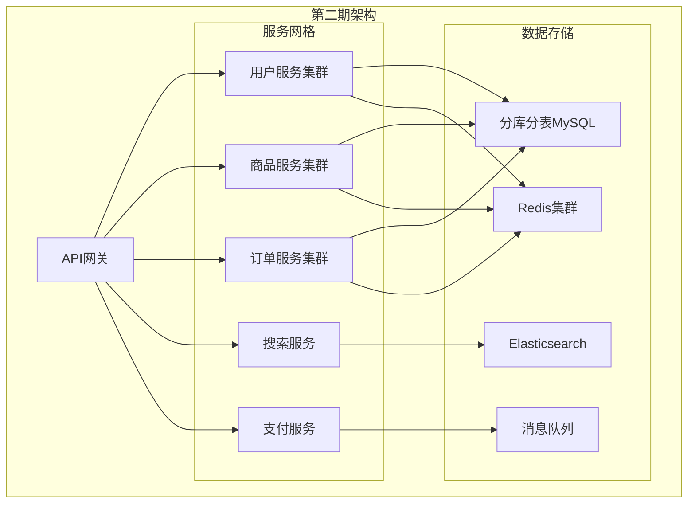

#### 3.2.3 分库分表策略

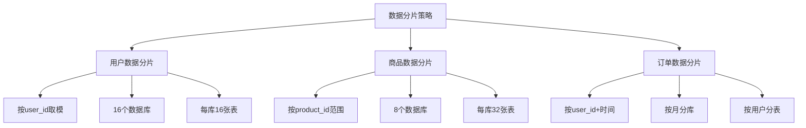

### 3.3 千亿级改造（12个月以上）

#### 3.3.1 终极目标
- 支持千万级QPS
- 多机房部署
- 大数据分析
- AI推荐系统

#### 3.3.2 千亿级架构

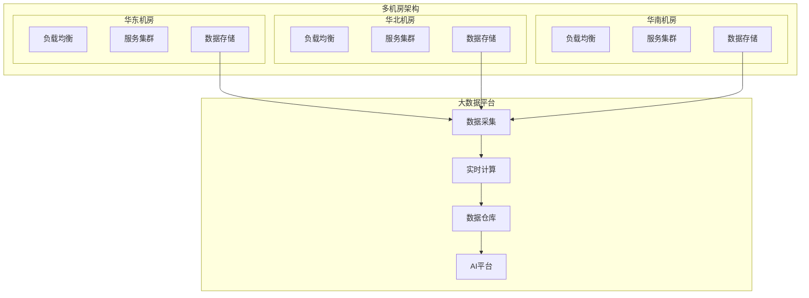

---

## 4. 技术架构演进

### 4.1 架构演进路径

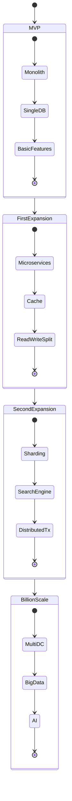

### 4.2 技术选型演进

| 阶段 | Web框架 | 数据库 | 缓存 | 消息队列 | 搜索 | 监控 |
|------|---------|--------|------|----------|------|---------|
| MVP | Gin | MySQL | 无 | 无 | SQL查询 | 日志 |
| 第一期 | Gin+中间件 | MySQL主从 | Redis | 无 | 改进SQL | Prometheus |
| 第二期 | 微服务+GRPC | 分库分表 | Redis集群 | Kafka | Elasticsearch | 完整监控 |
| 千亿级 | 服务网格 | 多副本 | 多级缓存 | Kafka集群 | ES集群 | 智能运维 |

### 4.3 Go语言技术栈演进

``go
// MVP阶段：简单Go Web应用
type MVPServer struct {
    db     *sql.DB
    router *gin.Engine
}

// 第一期：微服务架构
type MicroService struct {
    db    *gorm.DB
    redis *redis.Client
    grpc  *grpc.Server
}

// 第二期：服务网格
type ServiceMeshApp struct {
    db       *gorm.DB
    redis    *redis.Cluster
    kafka    *kafka.Writer
    es       *elasticsearch.Client
    circuit  *hystrix.CircuitBreaker
}

// 千亿级：云原生架构
type CloudNativeApp struct {
    db          ShardedDB
    cache       MultiLevelCache
    mq          DistributedMQ
    search      SearchCluster
    monitor     ObservabilityStack
    ai          MLPlatform
}
```

---

## 5. 团队建设规划

### 5.1 团队规模演进

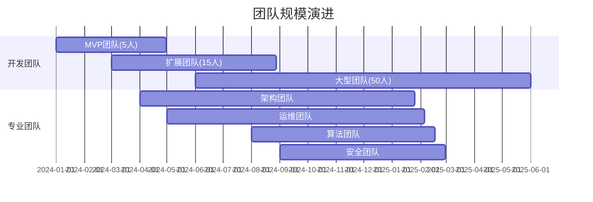

### 5.2 组织架构演进

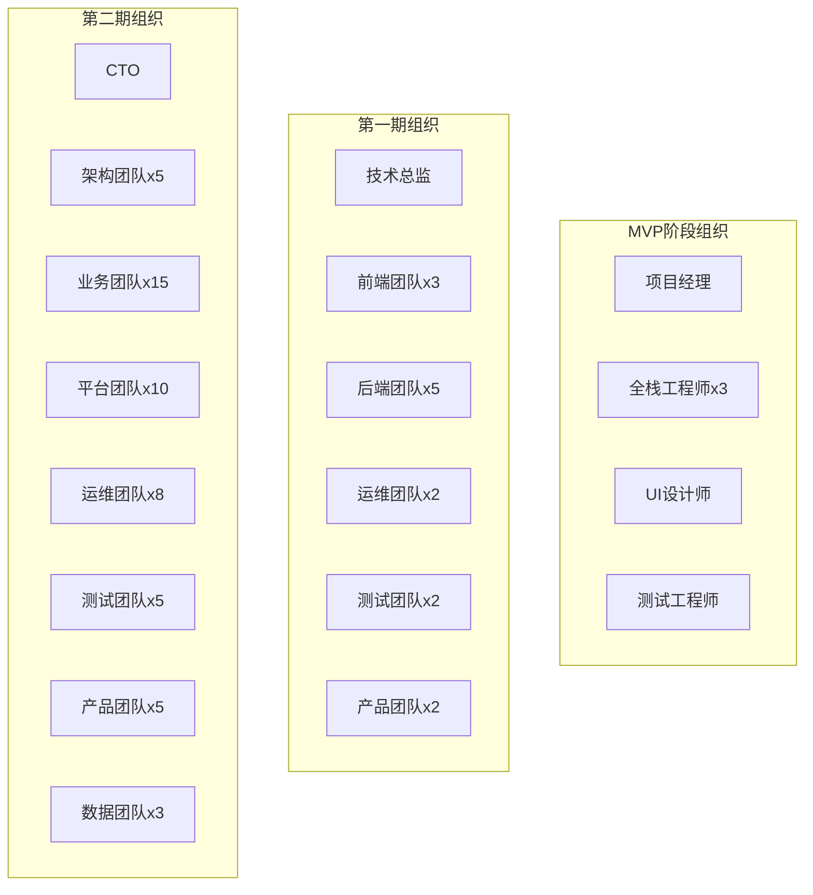

### 5.3 技能要求演进

| 阶段 | 核心技能 | 新增技能 | 团队规模 |
|------|----------|----------|----------|
| MVP | Go基础、MySQL、Web开发 | - | 5人 |
| 第一期 | 微服务、Redis、消息队列 | 分布式系统 | 15人 |
| 第二期 | 分库分表、ES、性能优化 | 大数据、运维 | 50人 |
| 千亿级 | 云原生、AI/ML、架构设计 | 算法、安全 | 100+人 |

---

## 6. 风险控制策略

### 6.1 技术风险控制

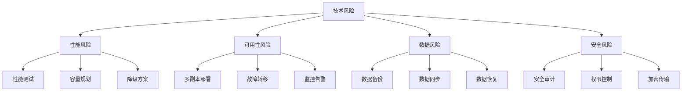

### 6.2 业务风险控制

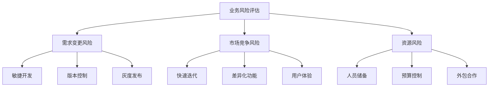

### 6.3 里程碑检查点

| 阶段 | 检查点 | 关键指标 | 风险应对 |
|------|--------|----------|----------|
| MVP | 3个月 | 基础功能完成度 | 功能简化、延期 |
| 第一期 | 6个月 | 性能提升效果 | 架构调整、优化 |
| 第二期 | 12个月 | 扩展性验证 | 重构、重设计 |
| 千亿级 | 24个月 | 全面性能指标 | 分阶段实施 |

---

## 验收标准

### MVP阶段验收标准
- [ ] 用户注册登录功能完整
- [ ] 商品发布查看功能完整
- [ ] 订单下单支付流程完整
- [ ] 系统可用性 > 95%
- [ ] 响应时间 < 2秒

### 第一期验收标准
- [ ] 微服务架构完成
- [ ] Redis缓存命中率 > 80%
- [ ] 读写分离正常工作
- [ ] QPS支持 > 1万
- [ ] 系统可用性 > 99%

### 第二期验收标准
- [ ] 分库分表完成
- [ ] ES搜索功能完整
- [ ] 分布式事务正常
- [ ] QPS支持 > 10万
- [ ] 系统可用性 > 99.9%

### 千亿级验收标准
- [ ] 多机房部署完成
- [ ] 大数据平台运行
- [ ] AI推荐系统上线
- [ ] QPS支持 > 100万
- [ ] 系统可用性 > 99.99%