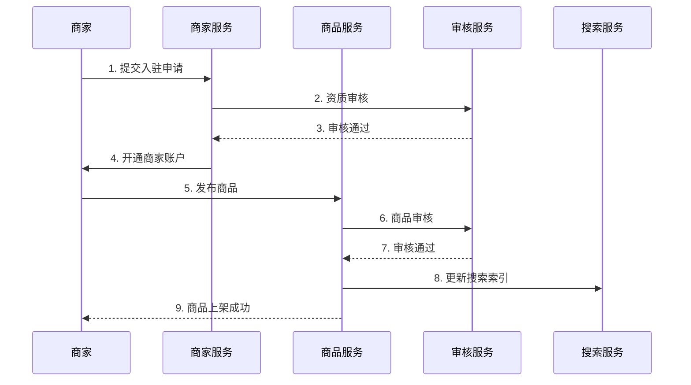
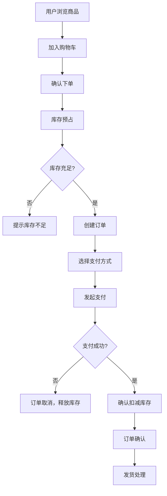
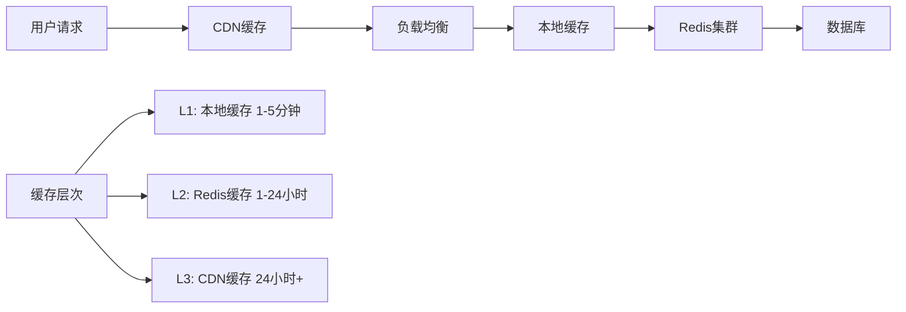
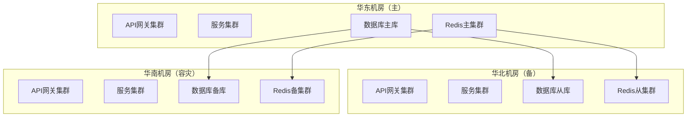
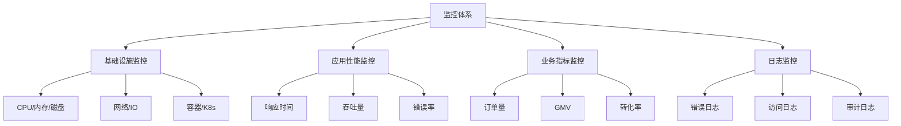
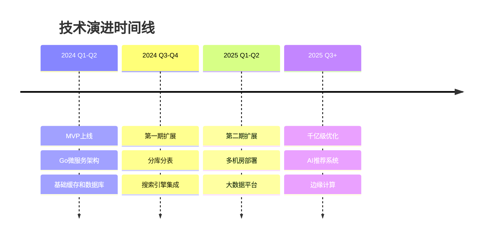

# 千亿量级亚马逊商品购买系统架构设计

## 目录

- [1. 系统概述和需求分析](#1-系统概述和需求分析)
- [2. 整体架构设计](#2-整体架构设计)
- [3. 核心服务架构](#3-核心服务架构)
- [4. 技术选型说明](#4-技术选型说明)
- [5. 数据库设计](#5-数据库设计)
- [6. 核心业务流程设计](#6-核心业务流程设计)
- [7. 高并发解决方案](#7-高并发解决方案)
- [8. 高可用和容灾设计](#8-高可用和容灾设计)
- [9. 监控和运维方案](#9-监控和运维方案)
- [10. 性能优化策略](#10-性能优化策略)
- [11. 安全设计](#11-安全设计)
- [12. 部署和容器化方案](#12-部署和容器化方案)
- [13. 未来扩展规划](#13-未来扩展规划)

---

## 1. 系统概述和需求分析

### 1.1 系统背景

设计一个能够支撑千亿量级的电商购买系统，类似亚马逊的规模，需要处理：
- 数亿级别的商品SKU
- 数十亿用户
- 日均千万级订单
- 每秒数百万QPS
- PB级数据存储

### 1.2 核心功能需求

#### 1.2.1 商品管理
- 商家/供应商商品录入
- 商品信息管理（基本信息、详情、图片等）
- 商品分类管理
- SKU管理
- 商品审核流程

#### 1.2.2 价格管理
- 实时价格更新
- 价格历史记录
- 促销价格管理
- 动态定价策略
- 价格变更通知

#### 1.2.3 库存管理
- 实时库存更新
- 库存预占和释放
- 安全库存管理
- 库存同步
- 库存预警

#### 1.2.4 搜索功能
- 全文搜索
- 筛选和排序
- 搜索建议
- 个性化推荐
- 搜索结果优化

#### 1.2.5 用户购买
- 用户注册/登录
- 商品浏览
- 购物车管理
- 下单流程
- 支付处理
- 订单管理

### 1.3 非功能性需求

#### 1.3.1 性能需求
- **并发处理能力**：支持千万级并发用户
- **响应时间**：
  - 商品搜索：< 200ms
  - 商品详情页：< 100ms
  - 下单流程：< 1s
  - 支付处理：< 3s

#### 1.3.2 可用性需求
- **系统可用性**：99.99%（年停机时间 < 53分钟）
- **服务恢复时间**：< 5分钟
- **数据备份**：实时备份，异地容灾

#### 1.3.3 扩展性需求
- **水平扩展**：支持服务无缝扩容
- **数据扩展**：支持数据量线性增长
- **功能扩展**：支持新功能快速迭代

#### 1.3.4 安全性需求
- **数据安全**：用户数据加密存储
- **交易安全**：支付数据安全传输
- **系统安全**：防SQL注入、XSS攻击等

---

## 2. 整体架构设计

### 2.1 架构原则

1. **微服务架构**：服务解耦，独立部署和扩展
2. **分层架构**：明确职责边界
3. **数据分离**：读写分离，冷热数据分离
4. **缓存优先**：多级缓存策略
5. **异步处理**：提高系统响应性能
6. **容错设计**：服务降级和熔断

### 2.2 整体架构图


### 2.3 网络架构


---

## 3. 核心服务架构

### 3.1 用户服务集群

#### 3.1.1 用户认证服务
- **功能**：用户注册、登录、JWT Token管理
- **技术栈**：Gin + GORM + Redis + MySQL
- **关键特性**：
  - 支持多种登录方式（手机号、邮箱、社交登录）
  - Token无状态设计
  - 分布式Session管理

#### 3.1.2 用户画像服务
- **功能**：用户行为分析、标签管理、个性化推荐数据
- **技术栈**：Python + Kafka + ClickHouse
- **关键特性**：
  - 实时用户行为收集
  - 机器学习算法应用
  - 用户分群和标签

#### 3.1.3 权限管理服务
- **功能**：RBAC权限控制、API鉴权
- **技术栈**：Gin中间件 + Redis
- **关键特性**：
  - 细粒度权限控制
  - 权限缓存优化
  - 多租户支持

### 3.2 商品服务集群

#### 3.2.1 商品管理服务
- **功能**：商品CRUD、分类管理、属性管理
- **技术栈**：Gin + GORM + MySQL + Redis
- **数据分片**：按商品ID范围分库分表
- **关键特性**：
  - 商品信息版本管理
  - 商品状态流转
  - 批量操作支持

#### 3.2.2 价格管理服务
- **功能**：价格设置、历史价格、促销价格
- **技术栈**：Go + MySQL + Redis + Kafka
- **关键特性**：
  - 高频价格更新支持
  - 价格变更事件通知
  - 价格策略引擎

#### 3.2.3 库存管理服务
- **功能**：库存扣减、预占释放、库存同步
- **技术栈**：Go + MySQL + Redis
- **关键特性**：
  - 高并发库存扣减
  - 分布式锁保证一致性
  - 库存预警机制

### 3.3 搜索服务集群

#### 3.3.1 搜索引擎服务
- **功能**：全文搜索、筛选排序、搜索建议
- **技术栈**：Elasticsearch + Kafka + Redis
- **关键特性**：
  - 分词和相关性优化
  - 搜索结果缓存
  - 热词预加载

#### 3.3.2 推荐服务
- **功能**：商品推荐、相关推荐、个性化推荐
- **技术栈**：Python + TensorFlow + Redis
- **关键特性**：
  - 协同过滤算法
  - 深度学习模型
  - A/B测试支持

#### 3.3.3 索引构建服务
- **功能**：搜索索引构建、增量更新
- **技术栈**：Apache Flink + Kafka + Elasticsearch
- **关键特性**：
  - 实时索引更新
  - 全量重建支持
  - 索引一致性保证

### 3.4 交易服务集群

#### 3.4.1 购物车服务
- **功能**：购物车管理、商品汇总
- **技术栈**：Redis + MySQL
- **关键特性**：
  - 高性能读写
  - 购物车持久化
  - 实时价格更新

#### 3.4.2 订单服务
- **功能**：订单创建、状态管理、订单查询
- **技术栈**：Gin + GORM + MySQL + Kafka
- **分片策略**：按用户ID + 时间分表
- **关键特性**：
  - 分布式事务处理
  - 订单状态机管理
  - 订单数据归档

#### 3.4.3 支付服务
- **功能**：支付处理、退款管理、对账
- **技术栈**：Gin + GORM + MySQL + Redis
- **关键特性**：
  - 多支付渠道接入
  - 支付安全保证
  - 异步通知处理

---

## 4. 技术选型说明

### 4.1 编程语言选型

#### 4.1.1 Go/Gin
- **适用场景**：核心业务服务（用户、订单、支付）
- **选择原因**：
  - 高并发性能优异，goroutine轻量级并发
  - 内存占用小，GC停顿时间短
  - 编译速度快，部署简单
  - 原生支持高性能网络编程
  - 微服务生态成熟

### 4.3 Go语言技术栈详细选型

#### 4.3.1 Web框架选择

```go
// Gin - 高性能 Web 框架
type WebServer struct {
    engine *gin.Engine
    config *Config
}

func NewWebServer(config *Config) *WebServer {
    gin.SetMode(gin.ReleaseMode)
    engine := gin.New()
    
    // 中间件配置
    engine.Use(gin.Recovery())
    engine.Use(cors.Default())
    engine.Use(ratelimit.RateLimitMiddleware())
    
    return &WebServer{
        engine: engine,
        config: config,
    }
}
```

#### 4.3.2 数据库ORM

```go
// GORM - Go语言ORM框架
type Database struct {
    db *gorm.DB
}

func NewDatabase(dsn string) (*Database, error) {
    db, err := gorm.Open(mysql.Open(dsn), &gorm.Config{
        Logger: logger.Default.LogMode(logger.Info),
        NamingStrategy: schema.NamingStrategy{
            SingularTable: true,
        },
    })
    if err != nil {
        return nil, err
    }
    
    // 连接池配置
    sqlDB, _ := db.DB()
    sqlDB.SetMaxIdleConns(10)
    sqlDB.SetMaxOpenConns(100)
    sqlDB.SetConnMaxLifetime(time.Hour)
    
    return &Database{db: db}, nil
}
```

#### 4.3.3 缓存客户端

```go
// Redis客户端
type CacheClient struct {
    rdb *redis.Client
}

func NewCacheClient(addr, password string, db int) *CacheClient {
    rdb := redis.NewClient(&redis.Options{
        Addr:     addr,
        Password: password,
        DB:       db,
        PoolSize: 100,
    })
    
    return &CacheClient{rdb: rdb}
}
```

#### 4.3.4 消息队列

```go
// Kafka生产者
type KafkaProducer struct {
    writer *kafka.Writer
}

func NewKafkaProducer(brokers []string, topic string) *KafkaProducer {
    return &KafkaProducer{
        writer: &kafka.Writer{
            Addr:     kafka.TCP(brokers...),
            Topic:    topic,
            Balancer: &kafka.LeastBytes{},
        },
    }
}
```

### 4.4 Go语言微服务架构实现

#### 4.4.1 服务注册与发现

```go
// 服务注册接口
type ServiceRegistry interface {
    Register(service *ServiceInfo) error
    Deregister(serviceID string) error
    Discover(serviceName string) ([]*ServiceInfo, error)
    HealthCheck(serviceID string) error
}

// Consul服务注册实现
type ConsulRegistry struct {
    client *consul.Client
}

func (c *ConsulRegistry) Register(service *ServiceInfo) error {
    registration := &consul.AgentServiceRegistration{
        ID:      service.ID,
        Name:    service.Name,
        Port:    service.Port,
        Address: service.Address,
        Check: &consul.AgentServiceCheck{
            HTTP:                           fmt.Sprintf("http://%s:%d/health", service.Address, service.Port),
            Timeout:                        "3s",
            Interval:                       "10s",
            DeregisterCriticalServiceAfter: "30s",
        },
    }
    
    return c.client.Agent().ServiceRegister(registration)
}
```

#### 4.4.2 配置管理

```go
// Viper 配置管理
type ConfigManager struct {
    viper *viper.Viper
}

func NewConfigManager() *ConfigManager {
    v := viper.New()
    v.SetConfigName("config")
    v.SetConfigType("yaml")
    v.AddConfigPath(".")
    v.AddConfigPath("/etc/app/")
    
    // 环境变量支持
    v.AutomaticEnv()
    v.SetEnvPrefix("APP")
    
    return &ConfigManager{viper: v}
}

type DatabaseConfig struct {
    Host     string `mapstructure:"host"`
    Port     int    `mapstructure:"port"`
    Username string `mapstructure:"username"`
    Password string `mapstructure:"password"`
    Database string `mapstructure:"database"`
}
```

#### 4.4.3 限流与熔断

```go
// 令牌桶限流
type RateLimiter struct {
    limiter *rate.Limiter
}

func NewRateLimiter(rps rate.Limit, burst int) *RateLimiter {
    return &RateLimiter{
        limiter: rate.NewLimiter(rps, burst),
    }
}

func (rl *RateLimiter) Allow() bool {
    return rl.limiter.Allow()
}

// 熔断器
type CircuitBreaker struct {
    hystrix *hystrix.CircuitBreaker
}

func NewCircuitBreaker(name string, config hystrix.CommandConfig) *CircuitBreaker {
    hystrix.ConfigureCommand(name, config)
    return &CircuitBreaker{
        hystrix: hystrix.NewCircuitBreaker(name),
    }
}

func (cb *CircuitBreaker) Execute(fn func() error) error {
    return hystrix.Do(cb.hystrix.Name, fn, nil)
}
```

### 4.2 数据存储选型

#### 4.2.1 MySQL
- **适用场景**：核心业务数据
- **选择原因**：
  - ACID事务保证
  - 数据一致性强
  - 运维经验丰富
  - 支持分库分表

**配置策略**：
- 主从复制 + 读写分离
- 分库分表策略
- 连接池优化

#### 4.2.2 Redis
- **适用场景**：缓存、会话、计数器
- **选择原因**：
  - 高性能读写
  - 丰富的数据结构
  - 持久化支持
  - 集群方案成熟

**使用场景**：
- 热点数据缓存
- 分布式锁
- 限流计数
- 购物车存储

#### 4.2.3 Elasticsearch
- **适用场景**：商品搜索、日志分析
- **选择原因**：
  - 全文搜索能力强
  - 分布式架构
  - 近实时搜索
  - 聚合分析能力

#### 4.2.4 MongoDB
- **适用场景**：商品详情、用户评论
- **选择原因**：
  - 文档型存储灵活
  - 水平扩展能力强
  - 适合半结构化数据
  - 读性能优秀

### 4.3 中间件选型

#### 4.3.1 Apache Kafka
- **适用场景**：事件驱动、数据同步
- **选择原因**：
  - 高吞吐量
  - 持久化消息
  - 分区并行处理
  - 生态完善

#### 4.3.2 Apache Flink
- **适用场景**：实时数据处理
- **选择原因**：
  - 低延迟流处理
  - 状态管理完善
  - 容错能力强
  - 支持批流一体

#### 4.3.3 Istio
- **适用场景**：服务网格
- **选择原因**：
  - 流量管理
  - 安全策略
  - 可观测性
  - 多语言支持

### 4.4 容器化和编排

#### 4.4.1 Kubernetes
- **选择原因**：
  - 容器编排标准
  - 自动扩缩容
  - 服务发现
  - 滚动更新
  - 生态完善

#### 4.4.2 Docker
- **选择原因**：
  - 环境一致性
  - 快速部署
  - 资源隔离
  - 镜像管理

---

## 5. 数据库设计

### 5.1 分库分表策略

#### 5.1.1 用户库分片策略
- **分片键**：user_id
- **分片算法**：一致性哈希
- **库数量**：64个库
- **表数量**：每库16张表

#### 5.1.2 商品库分片策略
- **分片键**：product_id
- **分片算法**：范围分片
- **库数量**：32个库
- **表数量**：每库32张表

#### 5.1.3 订单库分片策略
- **分片键**：user_id + order_time
- **分片算法**：复合分片
- **库数量**：按时间分库（月）
- **表数量**：按用户ID分表

### 5.2 核心表结构设计

#### 5.2.1 用户相关表

```sql
-- 用户基本信息表
CREATE TABLE users (
    user_id BIGINT PRIMARY KEY,
    username VARCHAR(50) UNIQUE NOT NULL,
    email VARCHAR(100) UNIQUE,
    phone VARCHAR(20) UNIQUE,
    password_hash VARCHAR(255) NOT NULL,
    salt VARCHAR(32) NOT NULL,
    status TINYINT DEFAULT 1,
    created_at TIMESTAMP DEFAULT CURRENT_TIMESTAMP,
    updated_at TIMESTAMP DEFAULT CURRENT_TIMESTAMP ON UPDATE CURRENT_TIMESTAMP,
    INDEX idx_email (email),
    INDEX idx_phone (phone),
    INDEX idx_created_at (created_at)
);

-- 用户画像表
CREATE TABLE user_profiles (
    user_id BIGINT PRIMARY KEY,
    age_group TINYINT,
    gender TINYINT,
    city_id INT,
    interests JSON,
    purchase_power DECIMAL(10,2),
    activity_level TINYINT,
    last_login_at TIMESTAMP,
    created_at TIMESTAMP DEFAULT CURRENT_TIMESTAMP,
    updated_at TIMESTAMP DEFAULT CURRENT_TIMESTAMP ON UPDATE CURRENT_TIMESTAMP,
    INDEX idx_city_id (city_id),
    INDEX idx_last_login (last_login_at)
);

-- 用户地址表
CREATE TABLE user_addresses (
    address_id BIGINT PRIMARY KEY,
    user_id BIGINT NOT NULL,
    recipient_name VARCHAR(50) NOT NULL,
    phone VARCHAR(20) NOT NULL,
    province VARCHAR(20) NOT NULL,
    city VARCHAR(20) NOT NULL,
    district VARCHAR(20) NOT NULL,
    detail_address VARCHAR(200) NOT NULL,
    postal_code VARCHAR(10),
    is_default TINYINT DEFAULT 0,
    created_at TIMESTAMP DEFAULT CURRENT_TIMESTAMP,
    updated_at TIMESTAMP DEFAULT CURRENT_TIMESTAMP ON UPDATE CURRENT_TIMESTAMP,
    INDEX idx_user_id (user_id),
    INDEX idx_default (user_id, is_default)
);
```

#### 5.2.2 商品相关表

```sql
-- 商品基本信息表
CREATE TABLE products (
    product_id BIGINT PRIMARY KEY,
    product_name VARCHAR(200) NOT NULL,
    brand_id INT,
    category_id INT,
    description TEXT,
    status TINYINT DEFAULT 1,
    seller_id BIGINT NOT NULL,
    created_at TIMESTAMP DEFAULT CURRENT_TIMESTAMP,
    updated_at TIMESTAMP DEFAULT CURRENT_TIMESTAMP ON UPDATE CURRENT_TIMESTAMP,
    INDEX idx_brand_id (brand_id),
    INDEX idx_category_id (category_id),
    INDEX idx_seller_id (seller_id),
    INDEX idx_status (status),
    FULLTEXT INDEX ft_name_desc (product_name, description)
);

-- SKU表
CREATE TABLE product_skus (
    sku_id BIGINT PRIMARY KEY,
    product_id BIGINT NOT NULL,
    sku_name VARCHAR(200) NOT NULL,
    sku_code VARCHAR(50) UNIQUE NOT NULL,
    attributes JSON,
    weight DECIMAL(8,3),
    dimensions VARCHAR(50),
    status TINYINT DEFAULT 1,
    created_at TIMESTAMP DEFAULT CURRENT_TIMESTAMP,
    updated_at TIMESTAMP DEFAULT CURRENT_TIMESTAMP ON UPDATE CURRENT_TIMESTAMP,
    INDEX idx_product_id (product_id),
    INDEX idx_sku_code (sku_code),
    INDEX idx_status (status)
);

-- 价格表（支持历史价格）
CREATE TABLE product_prices (
    price_id BIGINT PRIMARY KEY,
    sku_id BIGINT NOT NULL,
    price_type TINYINT NOT NULL, -- 1:原价 2:促销价 3:会员价
    price DECIMAL(10,2) NOT NULL,
    currency VARCHAR(3) DEFAULT 'CNY',
    start_time TIMESTAMP NOT NULL,
    end_time TIMESTAMP,
    is_active TINYINT DEFAULT 1,
    created_at TIMESTAMP DEFAULT CURRENT_TIMESTAMP,
    INDEX idx_sku_id (sku_id),
    INDEX idx_active_time (sku_id, is_active, start_time, end_time),
    INDEX idx_price_type (price_type)
);

-- 库存表
CREATE TABLE product_inventories (
    inventory_id BIGINT PRIMARY KEY,
    sku_id BIGINT NOT NULL UNIQUE,
    total_stock INT NOT NULL DEFAULT 0,
    available_stock INT NOT NULL DEFAULT 0,
    reserved_stock INT NOT NULL DEFAULT 0,
    safe_stock INT NOT NULL DEFAULT 0,
    warehouse_id INT NOT NULL,
    last_updated TIMESTAMP DEFAULT CURRENT_TIMESTAMP ON UPDATE CURRENT_TIMESTAMP,
    INDEX idx_sku_id (sku_id),
    INDEX idx_warehouse_id (warehouse_id),
    INDEX idx_available_stock (available_stock)
);

-- 商品分类表
CREATE TABLE categories (
    category_id INT PRIMARY KEY,
    parent_id INT DEFAULT 0,
    category_name VARCHAR(50) NOT NULL,
    level TINYINT NOT NULL,
    sort_order INT DEFAULT 0,
    is_active TINYINT DEFAULT 1,
    created_at TIMESTAMP DEFAULT CURRENT_TIMESTAMP,
    updated_at TIMESTAMP DEFAULT CURRENT_TIMESTAMP ON UPDATE CURRENT_TIMESTAMP,
    INDEX idx_parent_id (parent_id),
    INDEX idx_level (level),
    INDEX idx_sort_order (sort_order)
);
```

#### 5.2.3 交易相关表

```sql
-- 购物车表
CREATE TABLE shopping_carts (
    cart_id BIGINT PRIMARY KEY,
    user_id BIGINT NOT NULL,
    sku_id BIGINT NOT NULL,
    quantity INT NOT NULL DEFAULT 1,
    added_at TIMESTAMP DEFAULT CURRENT_TIMESTAMP,
    updated_at TIMESTAMP DEFAULT CURRENT_TIMESTAMP ON UPDATE CURRENT_TIMESTAMP,
    INDEX idx_user_id (user_id),
    INDEX idx_sku_id (sku_id),
    UNIQUE KEY uk_user_sku (user_id, sku_id)
);

-- 订单主表
CREATE TABLE orders (
    order_id BIGINT PRIMARY KEY,
    order_no VARCHAR(32) UNIQUE NOT NULL,
    user_id BIGINT NOT NULL,
    order_status TINYINT NOT NULL DEFAULT 1,
    payment_status TINYINT NOT NULL DEFAULT 0,
    shipping_status TINYINT NOT NULL DEFAULT 0,
    total_amount DECIMAL(12,2) NOT NULL,
    discount_amount DECIMAL(12,2) DEFAULT 0,
    shipping_fee DECIMAL(8,2) DEFAULT 0,
    actual_amount DECIMAL(12,2) NOT NULL,
    currency VARCHAR(3) DEFAULT 'CNY',
    shipping_address JSON NOT NULL,
    remark VARCHAR(500),
    order_time TIMESTAMP DEFAULT CURRENT_TIMESTAMP,
    payment_time TIMESTAMP NULL,
    shipping_time TIMESTAMP NULL,
    completed_time TIMESTAMP NULL,
    INDEX idx_user_id (user_id),
    INDEX idx_order_no (order_no),
    INDEX idx_status (order_status),
    INDEX idx_order_time (order_time)
);

-- 订单明细表
CREATE TABLE order_items (
    item_id BIGINT PRIMARY KEY,
    order_id BIGINT NOT NULL,
    sku_id BIGINT NOT NULL,
    product_name VARCHAR(200) NOT NULL,
    sku_name VARCHAR(200) NOT NULL,
    price DECIMAL(10,2) NOT NULL,
    quantity INT NOT NULL,
    subtotal DECIMAL(12,2) NOT NULL,
    INDEX idx_order_id (order_id),
    INDEX idx_sku_id (sku_id)
);

-- 支付记录表
CREATE TABLE payments (
    payment_id BIGINT PRIMARY KEY,
    payment_no VARCHAR(32) UNIQUE NOT NULL,
    order_id BIGINT NOT NULL,
    user_id BIGINT NOT NULL,
    payment_method TINYINT NOT NULL, -- 1:支付宝 2:微信 3:银行卡
    payment_channel VARCHAR(20) NOT NULL,
    amount DECIMAL(12,2) NOT NULL,
    currency VARCHAR(3) DEFAULT 'CNY',
    payment_status TINYINT NOT NULL DEFAULT 0,
    third_party_no VARCHAR(64),
    payment_time TIMESTAMP NULL,
    callback_time TIMESTAMP NULL,
    created_at TIMESTAMP DEFAULT CURRENT_TIMESTAMP,
    INDEX idx_order_id (order_id),
    INDEX idx_user_id (user_id),
    INDEX idx_payment_no (payment_no),
    INDEX idx_third_party_no (third_party_no),
    INDEX idx_payment_time (payment_time)
);
```

### 5.3 Redis数据结构设计

#### 5.3.1 缓存Key设计规范
```
用户信息: user:info:{user_id}
商品信息: product:info:{product_id}
SKU信息: sku:info:{sku_id}
价格信息: price:{sku_id}
库存信息: inventory:{sku_id}
购物车: cart:{user_id}
热门商品: hot:products:{category_id}
搜索热词: search:hot:words
用户会话: session:{session_id}
```

#### 5.3.2 数据结构使用
```redis
# 商品基本信息 - Hash
HSET product:info:123456 name "iPhone 15" brand "Apple" category "手机" price "7999.00"

# 库存信息 - String
SET inventory:sku:789012 1000
DECR inventory:sku:789012  # 扣减库存

# 购物车 - Hash
HSET cart:user:100001 sku:789012 2 sku:789013 1

# 热门商品列表 - ZSet（按销量排序）
ZADD hot:products:category:1 1000 product:123456 800 product:123457

# 搜索热词 - ZSet（按搜索次数排序）
ZADD search:hot:words 10000 "iPhone" 8000 "华为" 6000 "小米"

# 用户会话 - String（存储JWT Token信息）
SET session:abc123def456 '{"user_id":100001,"username":"user001","exp":1640995200}'

# 分布式锁 - String
SET lock:inventory:sku:789012 "thread_id_123" EX 10 NX

# 限流计数器 - String
SET rate:limit:user:100001:api:/product/search 10 EX 60

# 价格变更通知队列 - List
LPUSH price:change:queue '{"sku_id":789012,"old_price":7999,"new_price":7599,"timestamp":1640995200}'
```

---

## 6. 核心业务流程设计

### 6.1 商家入驻与商品管理流程



### 6.2 用户购买核心流程



### 6.3 价格变更流程

> 详细流程请参考：[商品价格频繁变动处理逻辑文档](2-千亿级电商系统-商品价格频繁变动处理逻辑.md)

### 6.4 搜索与推荐流程

> 详细流程请参考：[用户搜索整体流程图文档](3-千亿级电商系统-用户搜索整体流程图.md)

---

## 7. 高并发解决方案

### 7.1 缓存策略

#### 7.1.1 多级缓存架构



#### 7.1.2 Go语言缓存实现

```go
// 多级缓存管理器
type MultiLevelCache struct {
    localCache *freecache.Cache
    redis      *redis.Client
    ttl        time.Duration
}

func (mlc *MultiLevelCache) Get(ctx context.Context, key string) ([]byte, error) {
    // L1: 本地缓存
    if data, err := mlc.localCache.Get([]byte(key)); err == nil {
        return data, nil
    }
    
    // L2: Redis缓存
    data, err := mlc.redis.Get(ctx, key).Bytes()
    if err == nil {
        // 回写本地缓存
        mlc.localCache.Set([]byte(key), data, int(mlc.ttl.Seconds()))
        return data, nil
    }
    
    return nil, err
}
```

### 7.2 限流策略

#### 7.2.1 多层限流

```go
// 限流中间件
func RateLimitMiddleware(rps rate.Limit, burst int) gin.HandlerFunc {
    limiter := rate.NewLimiter(rps, burst)
    
    return func(c *gin.Context) {
        if !limiter.Allow() {
            c.JSON(http.StatusTooManyRequests, gin.H{
                "error": "rate limit exceeded",
            })
            c.Abort()
            return
        }
        c.Next()
    }
}
```

### 7.3 数据库优化

#### 7.3.1 分库分表策略

> 详细设计请参考：[表结构数据设计文档](1-千亿级电商系统-表结构数据设计与流程图.md)

#### 7.3.2 读写分离

```go
// 读写分离数据库管理
type DatabaseManager struct {
    masterDB *gorm.DB
    slaveDBs []*gorm.DB
    index    int64
}

func (dm *DatabaseManager) GetReadDB() *gorm.DB {
    // 轮询选择从库
    idx := atomic.AddInt64(&dm.index, 1) % int64(len(dm.slaveDBs))
    return dm.slaveDBs[idx]
}

func (dm *DatabaseManager) GetWriteDB() *gorm.DB {
    return dm.masterDB
}
```

---

## 8. 高可用和容灾设计

### 8.1 多机房部署



### 8.2 故障自动切换

```go
// 故障检测和自动切换
type FailoverManager struct {
    primary   *ServiceInstance
    backup    *ServiceInstance
    detector  *HealthDetector
    switcher  *TrafficSwitcher
}

func (fm *FailoverManager) StartMonitoring() {
    go func() {
        for {
            if !fm.detector.IsHealthy(fm.primary) {
                log.Warn("Primary service unhealthy, switching to backup")
                fm.switcher.SwitchTo(fm.backup)
            }
            time.Sleep(10 * time.Second)
        }
    }()
}
```

### 8.3 数据备份策略

- **实时备份**：MySQL主从复制，Redis集群同步
- **定期备份**：每日全量备份，每小时增量备份
- **异地备份**：备份数据同步至异地机房
- **快速恢复**：备份数据快速恢复机制，RTO < 5分钟

---

## 9. 监控和运维方案

### 9.1 监控体系



### 9.2 Go语言监控实现

```go
// Prometheus指标收集
type MetricsCollector struct {
    requestDuration *prometheus.HistogramVec
    requestTotal    *prometheus.CounterVec
    errorTotal      *prometheus.CounterVec
}

func NewMetricsCollector() *MetricsCollector {
    return &MetricsCollector{
        requestDuration: prometheus.NewHistogramVec(
            prometheus.HistogramOpts{
                Name: "http_request_duration_seconds",
                Help: "HTTP request duration",
            },
            []string{"method", "path", "status"},
        ),
        requestTotal: prometheus.NewCounterVec(
            prometheus.CounterOpts{
                Name: "http_requests_total",
                Help: "Total HTTP requests",
            },
            []string{"method", "path", "status"},
        ),
    }
}

// 监控中间件
func (mc *MetricsCollector) Middleware() gin.HandlerFunc {
    return func(c *gin.Context) {
        start := time.Now()
        
        c.Next()
        
        duration := time.Since(start).Seconds()
        status := strconv.Itoa(c.Writer.Status())
        
        mc.requestDuration.WithLabelValues(c.Request.Method, c.FullPath(), status).Observe(duration)
        mc.requestTotal.WithLabelValues(c.Request.Method, c.FullPath(), status).Inc()
    }
}
```

### 9.3 告警机制

- **阈值告警**：CPU > 80%、内存 > 85%、响应时间 > 1s
- **异常告警**：错误率 > 1%、服务不可用
- **业务告警**：订单量异常、支付失败率过高
- **告警渠道**：钉钉、邮件、短信、电话

---

## 10. 性能优化策略

### 10.1 Go语言性能优化

```go
// 连接池优化
type ConnectionPool struct {
    pool *sync.Pool
    size int
}

func NewConnectionPool(size int) *ConnectionPool {
    return &ConnectionPool{
        pool: &sync.Pool{
            New: func() interface{} {
                return createConnection()
            },
        },
        size: size,
    }
}

// 内存池优化
var bytePool = sync.Pool{
    New: func() interface{} {
        return make([]byte, 1024)
    },
}

func GetBuffer() []byte {
    return bytePool.Get().([]byte)
}

func PutBuffer(buf []byte) {
    bytePool.Put(buf[:0])
}
```

### 10.2 数据库性能优化

- **索引优化**：合理设计索引，避免过多索引
- **查询优化**：避免N+1查询，使用批量查询
- **连接池优化**：合理设置连接池大小
- **分区表**：对大表进行分区处理

### 10.3 缓存性能优化

- **缓存预热**：系统启动时预加载热点数据
- **缓存穿透**：布隆过滤器防止无效查询
- **缓存雪崩**：设置随机过期时间
- **缓存击穿**：使用分布式锁

---

## 11. 安全设计

### 11.1 数据安全

```go
// 数据加密
type EncryptionService struct {
    key []byte
}

func (es *EncryptionService) Encrypt(data []byte) ([]byte, error) {
    block, err := aes.NewCipher(es.key)
    if err != nil {
        return nil, err
    }
    
    gcm, err := cipher.NewGCM(block)
    if err != nil {
        return nil, err
    }
    
    nonce := make([]byte, gcm.NonceSize())
    if _, err := io.ReadFull(rand.Reader, nonce); err != nil {
        return nil, err
    }
    
    return gcm.Seal(nonce, nonce, data, nil), nil
}
```

### 11.2 API安全

- **身份认证**：JWT Token + 双因子认证
- **权限控制**：RBAC角色权限模型
- **API限流**：防止暴力攻击
- **输入验证**：参数校验和SQL注入防护
- **HTTPS**：全站HTTPS加密传输

### 11.3 支付安全

- **PCI DSS**：遵循支付卡行业数据安全标准
- **敏感数据加密**：信用卡号等敏感信息加密存储
- **交易监控**：异常交易实时监控和风控
- **数字签名**：支付请求数字签名验证

---

## 12. 部署和容器化方案

### 12.1 Kubernetes部署

```yaml
# Go微服务部署配置
apiVersion: apps/v1
kind: Deployment
metadata:
  name: product-service
spec:
  replicas: 10
  selector:
    matchLabels:
      app: product-service
  template:
    metadata:
      labels:
        app: product-service
    spec:
      containers:
      - name: product-service
        image: product-service:v1.0.0
        ports:
        - containerPort: 8080
        env:
        - name: DB_HOST
          valueFrom:
            secretKeyRef:
              name: db-secret
              key: host
        resources:
          requests:
            memory: "256Mi"
            cpu: "200m"
          limits:
            memory: "512Mi"
            cpu: "500m"
        livenessProbe:
          httpGet:
            path: /health
            port: 8080
          initialDelaySeconds: 30
          periodSeconds: 10
```

### 12.2 服务网格

- **Istio**：服务间通信管理
- **链路追踪**：Jaeger分布式追踪
- **流量管理**：灰度发布、A/B测试
- **安全策略**：mTLS、访问控制

### 12.3 CI/CD流水线

```yaml
# GitLab CI/CD配置
stages:
  - build
  - test
  - deploy

build:
  stage: build
  script:
    - go mod download
    - go build -o app ./cmd/server
    - docker build -t $CI_REGISTRY_IMAGE:$CI_COMMIT_SHA .
    - docker push $CI_REGISTRY_IMAGE:$CI_COMMIT_SHA

test:
  stage: test
  script:
    - go test -v ./...
    - go test -race -coverprofile=coverage.out ./...

deploy:
  stage: deploy
  script:
    - kubectl set image deployment/product-service product-service=$CI_REGISTRY_IMAGE:$CI_COMMIT_SHA
    - kubectl rollout status deployment/product-service
```

---

## 13. 未来扩展规划

### 13.1 技术演进路线



### 13.2 新技术集成

- **AI/ML**：智能推荐、价格优化、反欺诈
- **区块链**：供应链溯源、数字货币支付
- **边缘计算**：CDN升级、就近计算
- **5G/IoT**：物联网设备接入、实时数据

### 13.3 国际化扩展

- **多语言支持**：i18n国际化框架
- **多币种支付**：各国本地支付方式
- **合规要求**：GDPR、数据本地化
- **CDN全球化**：全球节点部署

---

## 总结

本架构设计基于Go语言技术栈，为千亿级电商系统提供了完整的解决方案。通过微服务架构、分布式数据库、多级缓存、消息队列等技术手段，确保系统能够支撑海量用户和交易。

**核心优势**：
- 🚀 **高性能**：Go语言天然的高并发优势
- 🔄 **高可用**：99.99%系统可用性保证
- 📈 **可扩展**：水平扩展支持业务增长
- 🛡️ **高安全**：多层安全防护体系
- 🔧 **易运维**：完善的监控和自动化运维

**实施建议**：
1. 按照MVP → 第一期 → 第二期 → 千亿级的路径渐进式实施
2. 重视数据架构设计，提前规划分库分表策略
3. 建立完善的监控和运维体系
4. 持续进行性能优化和技术升级

> 详细的技术实现请参考对应的专项文档：
> - [表结构数据设计与流程图](1-千亿级电商系统-表结构数据设计与流程图.md)
> - [商品价格频繁变动处理逻辑](2-千亿级电商系统-商品价格频繁变动处理逻辑.md)
> - [用户搜索整体流程图](3-千亿级电商系统-用户搜索整体流程图.md)
> - [MVP到千亿级发展路径](4-千亿级电商系统-MVP到千亿级发展路径.md)